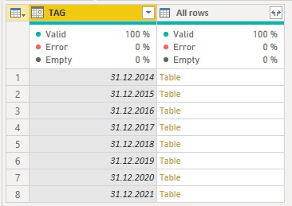
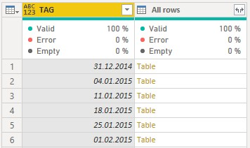

# [M-Code](https://learn.microsoft.com/en-us/powerquery-m/)

# Overview

Aid the cleaning and formating of data.


# Syntax

Define Source > Navigate to Source Details > Name each change based on last step > Repeat until done

    let
      Source = Your Source Link details
      # Source Info = Your Source Navigation Details
      # Applied Step 1 Name = M Code Action to Source Info
      # Applied Step 2 Name = M Code Action to Result of Applied Step 1,
      # Applied Step 3 Name = M Code Action to Result of Applied Step 2,
      # Applied Step 4 Name = M Code Action to Result of Applied Step 3
    in
      # Applied Step 4 Name
      
    let
      Source = Excel.Workbook(File.Contents(L1 - Grocery Store doc.xlsx"),null,true),
      #"Produce Sheet" = Source{[Item="Produce ",Kind="Sheet"]}[Data],
      #"Promoted Headers" = Tabe.PromoteHeaders(#"Produce Sheet","[Promot=true]),
      #"Changed Type" = Table.TransformColumnTypes(#"Promoted Headers",{...}),
      #"Removed Other Columns" = Table.SelectColumns(#"Changed Type",{"PLU",...},
      #"Removed Duplicates" = Table.Distinct(#"Removed Other Columns",{"PLU"})
    in
      #"Removed Duplicates"
      
## Text Object

    Text.PadStart(text.From([Month]),2,"0")
    
## Logic

    = each if [Month] >= FYStart
      then [Month] - (FYStart - 1)
      else [Month] + (12 - FYStart * 1)
      
### Operators

* And/Or
* = / <> / >= / &
</a>
      
## Date

    #date(2021,5,3)

* Date.From()
* Date.Month()
* Date.Day()
* Date.Year()
* DateTime.LocalNow()
</a>

## Time

    #time(23,59,59)

* Time.From(1/1/2021 12:00AM)
</a>

## Duration

    #duration()
    
* Duration.TotalHours
* Duration.TotalMinutes
* Duration.TotalSeconds
</a>

## Text

* Text.From
* Text.Start
* Text.Middle
* Text.Trim
* Text.Length
* Text.PadStart
* Text.PadEnd
* Replacer.RelplaceText
</a>

## Number

* Number.From
* Number.FromText
* Number.Round
* Replacer.ReplaceValue
</a>

## Lists

Format data to define new columns, or aggregate values of columns.

* List.Sum()
* List.Numberns({0..100})
* List.Dates(#date(2021,6,1),100,#duration(1,0,0,0)})
</a>

# Examples

## Duration to Hours
 ```m
= Table.AddColumn(#"Changed Type", "Duration Hours", 
each Duration.TotalHours(#duration([Duration],0,0,0)))
 ```
    
## Real Time Duration Hours
 ```m
= Table.AddColumn(#"Added Custom", "Real Time Duration Hours", 
each Duration.TotalHours(Date.From(DateTime.LocalNow())-[Date 1]))
 ```
    
## Identify Longer Durations
 ```m
= Table.AddColumn(#"Added Custom1", "Duration Check", 
each if [Real Time Duration Hours] > 800 then "Long" else "Short")
 ```
    
## Remove White Space
 ```m
#"Added Custom3" = Table.AddColumn(#"Added Custom2", "Category 2", 
 each Text.Trim([Category])),

#"Reordered Columns" = Table.ReorderColumns(#"Added Custom3",
{"Date 1", "Date 2", "Category", "Category 2", "Serial Number", 
"Duration", "Duration Hours", "Real Time Duration Hours", "Duration 
 Check"}),

#"Removed Columns" = Table.RemoveColumns(#"Reordered Columns",
{"Category"}),

#"Renamed Columns" = Table.RenameColumns(#"Removed Columns",
{{"Category 2", "Category"}})
 ```

## Convert Setial Numbers to Text With Leading Zeros
 ```m
#"Added Custom4" = Table.AddColumn(#"Renamed Columns", 
 "Serial Number 2", each Text.PadStart(Text.From
 ([Serial Number]),7,"0")),

#"Reordered Columns1" = Table.ReorderColumns(#"Added Custom4",
{"Date 1", "Date 2", "Category", "Serial Number", 
"Serial Number 2", "Duration", "Duration Hours", 
"Real Time Duration Hours", "Duration Check"}),

#"Removed Columns1" = Table.RemoveColumns(#"Reordered Columns1",
{"Serial Number"}),

#"Renamed Columns1" = Table.RenameColumns(#"Removed Columns1",
{{"Serial Number 2", "Serial Number"}})
```

## Add Missing Dates

Basis is a list with sparse dates. We need to fill the missing dates with the values of the sparese list.


### Group Sparse List by Date

Insert step "Grouped Rows"



 ```m
 #"Grouped Rows" = Table.Group(#"Renamed Columns", {"TAG"}, {{"All rows", each _, type table [Custom=nullable text, TAG=nullable date, Column1=nullable text, Value=number]}}),
 ```

### Create Table of missing Dates

Insert Step below "Grouped Rows". The table starts with the end of the week of the lowest date and creates dates in 7 day steps. Name this step "ListMissingDates"
 ```m
ListMissingDates = 
    Table.RenameColumns(
        Table.FromList(
            List.Difference(
                List.Dates(
                    Date.EndOfWeek(List.Min(#"Grouped Rows"[TAG])),
                    Duration.TotalDays(List.Max(#"Grouped Rows"[TAG])-List.Min(#"Grouped Rows"[TAG]))/7+53, 
                    #duration(7,0,0,0) 
                ), 
            #"Grouped Rows"[TAG]),     
        Splitter.SplitByNothing(),null, null, ExtraValues.Error), 
    {{"Column1", "TAG"}}),
 ```
        
### Merge Sparse List with missing Dates

Merge both tables, sort by date and fill missing rows
 ```m
Custom1 = Table.Combine({#"Grouped Rows", ListMissingDates}),
#"Sorted Rows" = Table.Sort(Custom1,{{"TAG", Order.Ascending}}),
#"Filled Down" = Table.FillDown(#"Sorted Rows",{"All rows"}),
 ```




### Expand Tables
 ```m
 #"Expanded All rows" = Table.ExpandTableColumn(#"Filled Down", "All rows", {"Custom", "Column1", "Value"}, {"Custom", "Column1", "Value"}),
 ```
       

