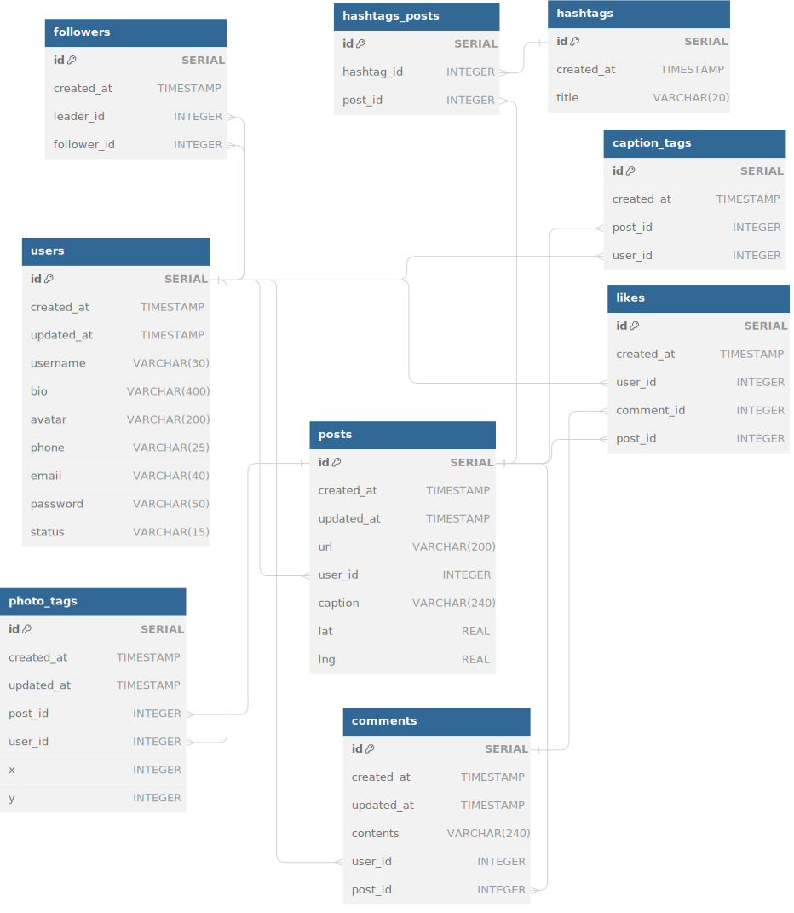

# PostgreSQL

## Setup

### Get and run Docker Image

```bash
$ docker pull postgres
$ docker run --name some-postgres -e POSTGRES_PASSWORD=mysecretpassword -d -p 5432:5432 postgres
```

### Connect to PostgreSQL container

|attribute|value|
|-|-|
|Host|localhost|
|Username|postgres|
|Port|5432|
|Password|mysecretpassword|

## Database Design

[dbdiagram.io](https://dbdiagram.io/)  



[Code](https://github.com/datainsightat/DataScience_Examples/tree/main/cs/postgresql)

```
Table users {
  id SERIAL [pk, increment]
  created_at TIMESTAMP
  updated_at TIMESTAMP
  username VARCHAR(30)
  bio VARCHAR(400)
  avatar VARCHAR(200)
  phone VARCHAR(25)
  email VARCHAR(40)
  password VARCHAR(50)
  status VARCHAR(15)
}

...
```

## Datatypes

### Numbers

|Datatype|Description|
|-|-|
|smalling|-32,768 to +32,767|
|integerr|-2,147,583,648 to +2,147,583,647|
|bigint|-9.22 10^18 to +9.22 10^18|
|smallserial|+1 to +32,767|
|serial|+1 to +2,147,583,647|
|bigserial|+1 to +9.22 10^18|
|decimalr|131,072 digits before decimal point, 16,383 after|
|numeric|131,072 digits before decimal point, 16,383 after|
|real|-1 10^37 to +1 10^37 with a least 6 place precision|
|double precision|-1 10^307 to +1 10^308 with a least 15 place precision|
|float|-same as real or double|

Creat table using these datatypes like so:

```sql
create table products (
    id serial primary key,
    name varchar(50).
    department varchar(50),
    price integer,
    weight integer
)
```

#### Characters

|Datatype|Description|
|-|-|
|char(5)|Store come characters, length will always be 5, even if PG has to insert spaces|
|varchar|Store any length of string|
|varchar(40)|Store a string up to 40 characters|
|text|Store any length of string|

#### Boolean

|Value|Boolean representation|
|-|-|
|true, yes, on 1, t, y|TRUE|
|false, no, off, 0, f, n|FALSE|
|null|NULL|

```sql
select ('yes'::BOOLEAN);
-> TRUE
```

#### Date and Time

|Date|Value|
|-|-|
|1980-11-20|20 November 1980|
|Nov-20-1980|20 November 1980|
|20-Nov-1980|20 November 1980|
|1980-November-20|20 November 1980|
|November 20, 1980|20 November 1980|

```sql
select ('NOV-20-1980')::DATE);
select ('NOV 20 1980')::DATE);
...
```

|Time|Value|
|-|-|
|01:23 AM|01:23, no time zone|
|05:23 PM|17:23, no time zone|
|20:34|20:34, no time zone|

```sql
select ('01:23 AM')::TIME);
select ('20:34')::TIME);
...
```

|Time with Timezone|Value|
|-|-|
|01:23 AM EST|01:23-05:00|
|05:23 PM PST|17:23-08:00|
|20:34 UTC|20:34+00:00|

```sql
select ('01:23 AM EST')::TIME WITH TIME ZONE);
select ('20:34 UTC')::TIME WITH TIME ZONE);
...
```

|Timestamp with Timezone|Value|
|-|-|
|Nov-20-1980 01:23 AM PST|1980-11-20 01:23:00-07|

```sql
select ('Nov-20-1980 01:23 AM PST')::TIMESTAMP WITH TIME ZONE);
```

### Intervals

|Interval|Description|
|-|-|
|1 day, 1 D|1 day|
|1 D 1 H 1 M 1 S|1 day 1 hour 1 minute 1 second|

```sql
select ('1 D 20 H 30 M 45 S')::INTERVAL);

select ('1 D 20 H 30 M 45 S')::INTERVAL) - ('1 D'::INTERVAL);
-> 20:30:45

select ('NOV-20-1980 1:23 AM EST')::TIMESTAMP WITH TIME ZONE)
-
('1 D'::INTERVAL);
-> 1980-11-18 23:23:00-07

select ('NOV-20-1980 1:23 AM EST'::TIMESTAMP WITH TIME ZONE)
-
('NOV-20-1980 11:43 AM EST'::TIMESTAMP WITH TIME ZONE);
-> { "hours": -10, "minutes": -20 }
```

## Basic SQL Commands

### *CREATE TABLE* > Create Table

```sql
create table cities (
    name varchar(50),
    country varchar(50),
    population integer,
    area integer
);
```

### *INSERT INTO* > Insert Data into Table

```sql
insert into cities (name,country,population,area)
values
    ('Delhi','India',28125000,2240),
    ('Shanghai','China',22125000,4015),
    ('Sao Paulo','Brazil',20935000,3043);
```

### *SELECT* > Select Data from Table

```sql
select * from cities;
select name,country from cities;
```

#### Calculated Columns

|Operator|Function|
|-|-|
|+|Add|
|-|Subtract|
|*|Multiply|
|/|Divice|
|^|Exponent|
|\|/|Square Root|
|@|Absolute Value|
|%|Remainder|

```sql
select
  name,
  population / area as population_denstity
from
  cities;
```

#### String Operators

|Operator|Function|
|-|-|
|\|\||Concatenate|
|concat()|Concatenate|
|lower()|Lowercase|
|upper()|Uppercase|
|length()|Number of characters|

```sql
SELECT
    name || ', ' || country,
    concat(name,', ',country),
    lower(name),
    upper(country),
    length(name)
FROM
    cities;
```

#### *DISTINCT* > Unique Values

```sql
select
    distinct
    country
from
    cities
```

#### *GREATER/LEAST* > Biggest, Smallest values

```sql
select
    name,
    weight,
    greatest(30,2*weight),
    least(30,2*weight)
from
    products;
```

#### *CASE* > If then else Statement

```sql
select
    name,
    price,
    case
        when price > 600 then 'high'
        when price > 300 then 'medium'
        else 'cheap'
    end
```

### *WHERE* > Filter Table

|Operator|Function|
|-|-|
|=|Equal|
|>|Greater|
|<|Smaller|
|>=|Greater or Equal|
|<=|Smaller or Equal|
|<>|Not Equal|
|!=|Not Equal|
|between|Between two values|
|in|Value in list|
|not in|Value not in list|
|is null|value is NULL|
|is not null|value is not null|

```sql
SELECT
    name,
    area
FROM
    cities
WHERE
    area between 2000 and 5000
    and name in ('Delhi','Shanghai');
```

### *UPDATE* > Update rows

```sql
UPDATE
    cities
set
    population = 39505000
WHERE
    name = 'Shanghai';
```

### *DELETE* > Delete rows

```sql
DELETE FROM
    cities
WHERE
    name = 'Tokyo';
```

## Tables

### Primary Keys and Foreign Keys

- Primary Key: Uniquely identifies a record in a table
    - You cannot delete a user with a key, that is refenced by a foreign key in another table
        - ON DELETE RESTRICT > error
        - ON DELETE NO ACTION > error
        - ON DELETE CASCADE > delete value in associated table too!
        - ON DELETE SET NULL
        - ON DELETE SET DEFAULT
- Foreign Key: Identifies a record in another table that this record is associated with
    - The foreign key must exist in the associated table
    - You can add a value with user 'NULL'
</a>

```sql
create Table users (
    id serial primary key,
    username varchar(50)
);

insert INTO
    users (username)
VALUES
    ('monahan93'),
    ('pferrer'),
    ('si930nis'),
    ('99stroman');

select * from users;
```
|id|username|
|-|-|
|1|monahan93|
|2|pferrer|
|3|si930nis|
|4|99stroman|

```sql
create Table photos (
    id serial primary key,
    url varchar(200),
    user_id integer REFERENCES users(id) on delete cascade
);

insert INTO
    photos (url,user_id)
VALUES
    ('http://img1.jpg',4),
    ('http://img2.jpg',4),
    ('http://img3.jpg',1),
    ('http://img4.jpg',2),
    ('http://img01.jp2',NULL); 

select * from photos;
```
|id|url|user_id|
|-|-|-|
|1|http://img1.jpg|4|
|2|http://img2.jpg|4|
|3|http://img3.jpg|1|
|4|http://img4.jpg|2|

The 'SERIAL' keyword lets the index column increase by 1, each time a new record is inserted.

```sql
create Table comments (
    id serial primary key,
    photo_id integer REFERENCES photos(id) on delete cascade,
    user_id integer REFERENCES photos(id) on delete cascade,
    contents varchar(240)
);

insert INTO
    comments (contents,photo_id,user_id)
VALUES
    ('Quo velit iusto ducimus quos a incidunt nesciunt facilis.', 2, 1),
    ('Non est totam.', 2, 1),
    ('Fuga et iste beatae.', 3, 2),
    ('Molestias tempore est.', 1, 2);

select * from comments;
```
|id|photo_id|user_id|contents|
|-|-|-|-|
|1|2|1|Quo velit iusto ducimus quos a incidunt nesciunt facilis.|
|2|2|1|Non est totam.|
|3|3|2|Fuga et iste beatae.|
|4|1|2|Molestias tempore est.|

### Validation

#### NOT NULL

The value must not be null

```sql
create table products (
    is serial primary key,
    name varchar(50),
    department varchar(50),
    price integer not null,
    weight integer
);
```

Add validation to existing column. If the column contains already null values, these values need to be replaced by actual values.

```sql
update
    products
set
    price = 999
where
    price is null;

alter table
    products
alter column
    price
set not null;
```

#### DEFAULT

Set a default value for unspecified columns.

```sql
create table products (
    is serial primary key,
    name varchar(50),
    department varchar(50),
    price integer default 999,
    weight integer
);

alter table
    products
alter column
    price
set default 999;
```

#### UNIQUE

Ensure that column values are unique.

```sql
create table products (
    is serial primary key,
    name varchar(50) unique,
    department varchar(50),
    price integer default 999,
    weight integer
);
```

You cannot add the constraint to existing tables, if the column contans mulitple entries with the same value.

```sql
alter table
    products
alter column
    name
add unique (name);

alter table
    products
drop constraint products_name_key;
```

##### Multi column Uniqueness

```sql
create table products (
    is serial primary key,
    name varchar(50),
    department varchar(50),
    price integer default 999,
    weight integer,
    unique(name,department)
);

alter table
    products
add unique (name, department);
```

### Validation Check

```sql
create table products (
    is serial primary key,
    name varchar(50),
    department varchar(50),
    price integer check (price > 0),
    weight integer
);
```

Existing rows must satisfy the restriction.

```sql
alter table
    products
add check (price > 0);
```

## Views

Create a fake table that has rows from other tables. These rows can be exact rows as they exist on another table, or a computed value. You can referance a view in any place where we would normally reference a table. View don't create a new table or move any data around.

```sql
create view tags as (
  select
    id,
    created_at,
    user_id,
    post_id,
    'photo_tag' as type
  from
    photo_tags

  union all

  select
    id,
    created_at,
    user_id,
    post_id,
    'caption_tag' as type
  from
    caption_tags
);

select * from tags;
```

### Materialized Views

Query that gets executed only at very specific times, gut the results are saved an can be referenced without rerunning the query.

```sql
create materialized view weekly_likes as (
  select
    date_trunc('week', coalesce(posts.created_at, comments.created_at)) as week,
    count(posts.id) as num_likes_for_posts,
    count(comments.id) as num_likes_for_comments
  from
    likes
  left join
    posts on
      posts.id = likes.post_id
  left join
    comments on
      comments.id = likes.comment_id
  group by
    week
  order by
    week
) with data;

select * from weekly_likes;

refresh materialized view weekly_likes;
```

## Transactions

Every time you access the PG database, you create a connection to the database. Each connection can access all the data from the database. Start a transaction using the 'BEGIN' keyword. The transaction isolates a connection from other connections. Just this connection can access the table that is uses inside the transaction. Changes within the transaction are just shown in the connection. Other connections do no see the changes until the transaction is closed using the 'COMMIT' keyword. If a connection crashes, PG undoes any changes within the transaction.

|Keyword|Action|
|-|-|
|BEGIN|Start transaction|
|COMMIT|End connection. Merge changes|
|ROLLBACK|End transaction. Undo changes|

```sql
create table accounts (
  id serial primary_key,
  name varchar(20) not null,
  balance integer not null
);

insert into
  accounts (name, balance)
values
  ('Gia',100),
  ('Alyson',100);

begin; -- Start Transaction.

update
  accounts
set
  balance = balance - 50
where name = 'Gia';

commit; -- End Transaction. Merge changes to database.
--rollback; -- End Transaction. Remove changes.
```

## Joins

For each comment, show the contents of the comment and the username of the user who wrote the comment:

```sql
SELECT
  a.contents,
  b.username
FROM
  comments a
JOIN
  users b ON
    a.user_id = b.id;
```


Search for all users that commented on their own photos.

```sql
SELECT
  url, contents, username
FROM
  comments a
JOIN
  photos b on
    b.id = a.photo_id
JOIN
  users c ON
    c.id = a.user_id
    and a.user_id = b.user_id;
```

## Aggregation

|Function|Description|
|-|-|
|COUNT()|Number of values|
|SUM()|Sum of a group of numbers|
|AVG()|Average of a group of numbers|
|MIN()|Minimum|
|MAX()|Maximum|

### *GROUP BY* > Groups rows by a unique set of values

```sql
SELECT
  user_id,
  count(*)
FROM
  photos
GROUP BY
 user_id;
```

### *HAVING* > Filter the set of groups

HAVING filters grouped values

```sql
SELECT
  b.username,
  count(*)
FROM
  photos a
LEFT JOIN
  users b ON
    b.id = a.user_id
GROUP BY
  b.username
HAVING
  count(*) >= 4;
```

## Sorting

### *ORDER BY* > Sort columns

```sql
select
    *
from
    products
order by
    price,
    weight desc;
```

### *OFFSET* > Skip the first n lines

```sql
select
    *
from
    users
offset
    10;
```

### *LIMIT* > Get specific number of records

```sql
select
    *
from
    users
limit
    5;
```

## Union and Intersections

'UNION' removes identical entries. Use the 'UNION ALL' keyword wo keep identical records.

|Keyword|Function|
|-|-|
|UNION|Join together the reults of two queries and remove duplicate rows|
|UNION ALL|Join together results of two queries|
|INTERSECT|Find the rows common in the results of two queries. Remove duplicates|
|INTERSECT ALL|Find the rows common in the results of two queries|
|EXCEPT|Find the rows that are present in first query but not second query. Remove duplicates|
|EXCEPT ALL|Find the rows that are present in first query butg not second query|

```sql
(
    select
        *
    from
        products
    order by
        price desc
    limit
        4
)

union

(
    select
        *
    from
        products
    order by
        price / weight desc
    limit
        4
);
```

## Subqueries

The shape of data matters in the use of subqueries

|Statement|shape|
|-|-|
|select * from orders|Many rows, many columns|
|select id from orders|Many rows, one column|
|select count(*) from orders|Single value|

### Subqueries in SELECT Statements

Any subquery must result in a single value

```sql
select
    name,
    price,
    (select max(price) from products) price_max,
    (select price from products where id = 3) price_id_3
from
    products
where
    price > 867;
```

### Subqueries in FROM Statements

Any subquery compatible to the outer query. Apply alias to subquery.

```sql
select
    avg(p.order_count)
from (
    select
        user_id,
        count(*) as order_count
    from
        orders
    group by
        user_id
) as p;
```

### Subqueries in JOIN Clauses

Any subquery that is compatible to the on statement

```sql
select
    u.first_name
from
    users as u
join (
    select
        user_id
    from
        orders
    where
        product_id = 3
) as o on
    u.id = o.user_id;
```

### Subqueries in WHERE Statements

|Operator|Datastructure|
|-|-|
|>,<,>=,<=,=,<>,!=|Single Value|
|IN, NOT IN|Single Column|
|(>,<,>=,<=,=,<>) ALL/SOME/ANY|Single Column|

```sql
select
    id
from
    orders
where
    product_id in (
        select
            id
        from
            products
        where
            price / weight > 5
);
```

```sql
SELECT
    name, price
FROM
    products
WHERE
    price > (
        SELECT
            max(price)
        FROM
            products
        WHERE
            department = 'toys'
    );
```

|Operator|Description|
|-|-|
|ALL|All items in list|
|SOME/ANY|At least one item in list|

```sql
select
    name,
    department,
    price
from
    products
where
    price > some (
        select
            price
        from
            products
        where
            department = 'Industrial'
);
```

### Correlated Subqueries

Get the most expensive product for each department

```sql
select
    name,
    deparment,
    price
from
    products p1
where
    p1.price = (
        select
            max(price)
        from
            products p2
        where
            p2.department = p1.department
);
```

```sql
select
    p1.name
    (
        select
            count(*)
        from
            orders as o1
        where
            o1.product_id = p1.id
    ) as num_orders
from
    products as p1
```

### Common Table Expressions (CTEs)

```sql
with
  tags as (
    select
      user_id,
      created_at
    from
      caption_tags

    union all

    select
      user_id,
      created_at
    from
      photo_tags
  )

select
  username,
  tags.created_at
from
  users
join
  tags on
    tags.user_is = users.id
where
  tags.created_at < '2020-01-07';
```

### Recursive CTEs

Very different from simple CTEs. They are useful anytime you have a tree or graph-type data structure. Every recursive CTE has a union inside it.

```sql
with
  recursive countdown(val) as (

    select -- working table
      3 as val

    union

    select -- results table
      val - 1
    from
      countdown
    where
      val > 1
  )

select
  *
from
  countdown;
```


```sql
with
  recursive suggestions(leader_id,follower_id,depth) as (
    select
      leader_id,
      follow_id,
      1 as depth
    from
      followers
    where
      follower_id = 1000 -- 'me'

    union

    select
      followers.leader_id,
      followers.follower_id,
      depth + 1
    from
      followers
    join
      suggestions on
        suggestions.leader_id = followers.follower_id
    where
      depth < 3
  )

select distinct
  users.id,
  users.username
from
  suggestions
join
  users on
    users.id = suggestions.leader_id
where
  depth > 1
limit
  30;
```

## Performance

Minimize the amount of data loaded from heap files to memory. A 'full table scan' requires postgresql to load all heap files into memory. 

### Internals

|Term|Description|
|-|-|
|Heap, Heap File|File that contains all data of a table|
|Tuple, Item|Individual row of a table|
|Block, Page|A heap file is divided into many 'blocks'|

```sql
select oid, datname from pg_database; -- id databases

select * from pq_class; -- id objects

show data_directory; -- folder where data is stored

select * from pq_stats where tablename = 'users'; -- statistics about columns of the table
```

### Index

An index tells the query which heap file(s) to load in order to retrieve the information.

```sql
create index on users (username);
```

### Query Tuning

SQL Query > Parser > Rewrite > Planner > Execute

#### *EXPLAIN, EXPLAN ANALYZE* > Display info about query

Explan builds the query and provides information about it, but does not run it. Explan Analyze actually runs the query.

```sql
EXPLAIN ANALYZE SELECT
    username,
    contents
FROM
    users
JOIN
    comments ON
        comments.user_id = users.id
WHERE
    username = 'Alyson14';
```

Analyze the result from the inner most rows to the outer rows. Costs flow upwards.

```
Hash Join  (cost=8.17..19.95 rows=3 width=576) (actual time=0.003..0.004 rows=0 loops=1)
  Hash Cond: (comments.user_id = users.id)
  ->  Seq Scan on comments  (cost=0.00..11.40 rows=140 width=502) (actual time=0.002..0.002 rows=0 loops=1)
  ->  Hash  (cost=8.16..8.16 rows=1 width=82) (never executed)
        ->  Index Scan using users_username_idx on users  (cost=0.14..8.16 rows=1 width=82) (never executed)
              Index Cond: ((username)::text = 'Alyson14'::text)

Planning Time: 0.136 ms
Execution Time: 0.038 ms
```

|Step|Description|
|-|-|
|->|Query node. Access, or process data|
|Hash|How the node is generating data|
|cost|Amount of processing power, time, required for the step|
|rows|How many rows will be produced|
|width|average number of bytes or each row|

#### Cost Calculation

Costs are shown in two numbers. The first is the cost for the first row, the second ist the cost for all other rows.

```
cost=8.17..19.95

Cost =
  (# pages read sequentially) * seq_page_cost
  + (# pages read at random) * random_page_cost
  + (# rows scanned) * cpu_tuple_cost
  + (# index entries scanned) * cpu_index_tuple_cost
  + (# times function/operator evaluated) * cpu_operator_cost
```

[Cost Factors](postgresql.org/docs/current/runtime-config-query.html)

 |Factor|Cost|
 |-|-|
 |seq_page_cost|1.0|
 |random_page_cost|4.0|
 |cpu_tuple_cost|0.01|
 |cpu_index_tuple_cost|0.005|
 |cpu_operator_cost|0.0025|

## Migrations

### Schema Migrations

* Changes to the DB structure and changes to clients need to be made at precisely the same time
* When working with other engineers, we need a really easy way to tie the  structure of our database to our code
</a>


#### Schema Migration File

A schema migration file contains two sections: up and down:
* The up section contains a statement that advances, or upgrades the structure of our DB
* The down section undos the up section
</a>

```sql
--up
alter table
  comments
rename column
  contents
to
  body;

--down
alter table
  comments
rename column
  body
to
  comments;
```

#### Example Create Table

```sql
--up
create table comments (
  id serial primary key,
  created_at timestamp,
  updated_at timestamp,
  contents varchar(240),
);

--down
drop table comments;
```

### Data Migration

Schema Migration > Data Migration > Schema Migration  

1) Add column
2) Deploy new Version of API that fills both old column and new column
3) Copy data to new column
4) Deploy new version of API to write data just to new column
5) Drop old column
</a>

[Demo Webserver](https://github.com/datainsightat/DataScience_Examples/blob/main/cs/postgresql/index.js)


