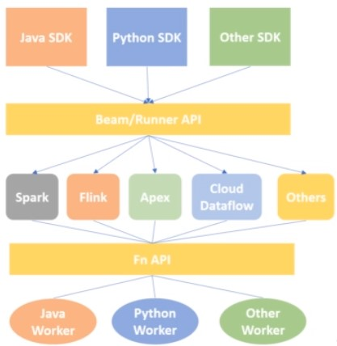

# Apache Beam

## Introduction

Unified programming model for efficient and portable Big data processing pipelines. Beam is able to process batch and  streaming data (Batch + Stream = Beam). A Beam pipeline can be created in any language like Java, Python, Go etc and be able to run on any of the execution frameworks like Spark, Flink, Apex, Cloud DataFlow.  

### Evolution BigData Framworks

### Architecture

### Flow of Beam Programming Model

Input > Transform > PCollection > Transform > PCollection > Transform > Output

#### Example

Input > Read > P1 > Filter > P2 > GroupBy > P3 > Sum > Output

    import apache_beam as beam
    
    p1 = beam.Pipeline()
    
    attendance_count = (
    
      p1
        | beam.io.REadFromText('dept_data.txt'=
        | beam.Map(lamda record: record.split(','))
        | beam.Filter(lambda record: record[3] == 'accounts')
        | beam.Map(lambda record: (record[1],1))
        | beam.CombinePerKey(sum)
        | beam.io.writeToText('data/output_new_final')
      )

    p1.run()
    
### Basic Terminology

* Pipeline: Encapsulates entire data processing task, from start to finish
* PCollection: Equivalent to RDD in Spark. Represents a distributed data set
  * Immutability: PCollections are immutable in nature
  * Element Type: The elements in a PCollection may be of any type, but all must be of the same type
  * Operation Type: PCollections does not support graned operations.
  * TimeStamp: Each Element in a PCollection has an associated timestamp with it.
* PTransform: Represents a data processing operations: ParDo, Filter, Flatten, Combine ...
<a/>

### Installation

Google Colab: https://colab.research.google.com/?utm_source=scs-index
    
## Transformations in Beam

### Read Transforms

#### Files

* ReadFromText(): parses a text file as newline delimited elements.
    * file_pattern(str): Full path of input file. /data/input*.txt
    * min_bundle_size(int): Splits source into bundles for parallel processing.
    * compression_type(str): Specifies compression type of input
    * strip_trailing_newlines(boolean): Should source remove newline character from each line before reading it.
    * validate(boolean): Verify the presence of file during pipeline creation
    * skip_header_lines(int): Specify the number of header lines
* ReadFromAvro(): Read Avro files
    * file_pattern(str)
    * min_bundle_size(int)
    * validate(boolean)
    * use_fastavro(boolean): Uses 'fastavro' libraray to read the file.
* ReadFromParquet(): Read Parquet files
    * file_pattern(str)
    * min_bundle_size(int)
    * validate(boolean)
    * columns(list[str]): Specifies the list of columns that will be read from the input file.
* ReadFromTFRecord(): Read tensor flow records. Simple format for storing a sequence of binary records
    * file_pattern(str)
    * validate(boolean)
    * compression_type(str)
    * coder(str): Specifies the coder name to decode the input record. Default 'bytesCoder'

#### Messaging Queues

* ReadFromPubSub(): Read messages from Google PubSub service
    * topic(str): Topic name where the messages are getting published
    * subscription(str): Subscription name
    * id_label(str): Attribute from incoming messages which should be considered as unique identifier
    * with_attributes(boolean): Output elements will be of type 'objects', otherwise of type 'bytes'.
    * timestamp_attributes(int): Value used as element timestamp. Specified argument should be a numerical value representing the number of milliseconds since the Unix epoch.

### Write Transforms

* WriteToText(): writes each element of the PCollection as a single line in the output file
    * file_path_prefix(str): Path to write the oCollectoin
    * file_name_suffix(str): Suffix of output file name
    * num_shards(int): Number of shards
    * append_trailing_newlines(boolean): Should lines be delimited with newline
    * coder(str): Coder name to encode each line
    * compression_type(str): Compression type of output file
    * header(str): Header line of ouput file
* WriteToAvro(): Write Avro file
    * file_path_prefix(str)
    * file_name_suffix(str)
    * num_shards(int)
    * compression_type(str)
    * schema: The schema to use for writing, as returned by avro.schema.Parse
    * codec: Compression codec to use for block level compression. Default 'deflate'
    * use_fastavro(boolean): Use 'fastavro' library
    * mime_type: Mime type for the produced output files
* WriteToParquet(): Write to Parquet File
    * file_path_prefix(str)
    * file_name_suffix(str)
    * num_shards(int)
    * schema
    * codec
    * mime_type
    * row_group_buffer_size: Byte size of the row group buffer
    * record_batch_size: Number of records in each record batch
* WriteToTFRecord(): Write to Tensor Flow records
    * file_path_prefix(str)
    * file_name_suffix(str)
    * num_shards(int)
    * compression_type(str)
* WriteToPubsub(): Write to PubSub service
    * topic(str): Topic name where the messages are getting published
    * id_label(str): Attribute from incoming messages which should be considered as unique identifier
    * with_attributes(boolean): Output elements will be of type 'objects', otherwise of type 'bytes'.
    * timestamp_attributes(int): Value used as element timestamp. Specified argument should be a numerical value representing the number of milliseconds since the Unix epoch.
<a/>

