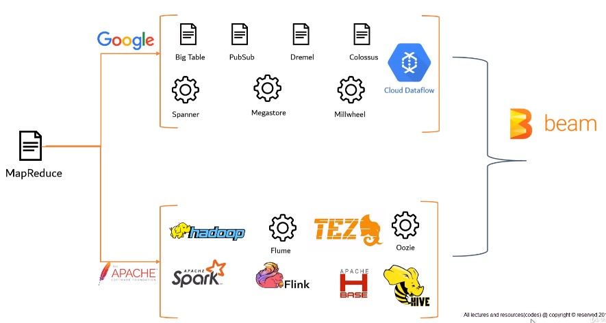
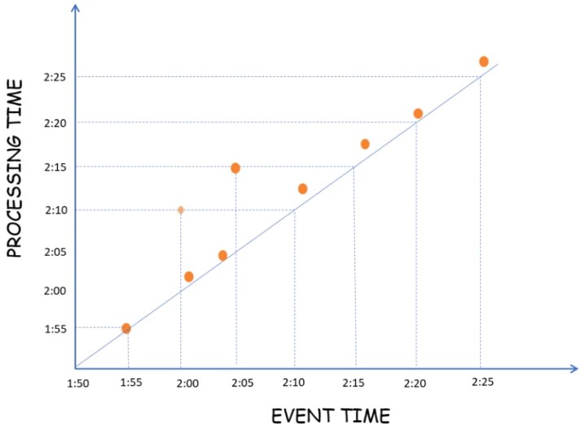
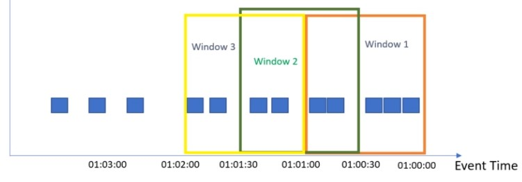
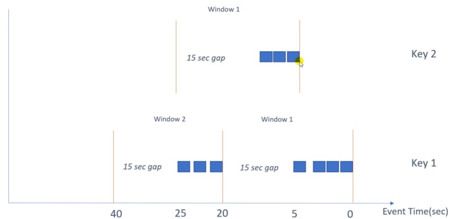
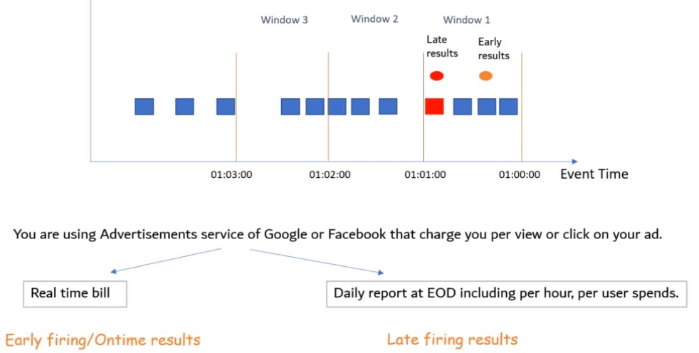

# Apache Beam

## Source

https://www.udemy.com/share/102dea3@eL-yo5Kxb3rwTFhsHjhoKrSfdMPGMf6NtzfCEg1P1-m11kFEWjMTBIV9gGxDt792/

## Introduction

Unified programming model for efficient and portable Big data processing pipelines. Beam is able to process batch and  streaming data (Batch + Stream = Beam). A Beam pipeline can be created in any language like Java, Python, Go etc and be able to run on any of the execution frameworks like Spark, Flink, Apex, Cloud DataFlow.  

### Evolution BigData Framworks

### Architecture

### Flow of Beam Programming Model

Input > Transform > PCollection > Transform > PCollection > Transform > Output

#### Example

Input > Read > P1 > Filter > P2 > GroupBy > P3 > Sum > Output

    import apache_beam as beam
    
    p1 = beam.Pipeline()
    
    attendance_count = (
    
      p1
        | beam.io.REadFromText('dept_data.txt'=
        | beam.Map(lamda record: record.split(','))
        | beam.Filter(lambda record: record[3] == 'accounts')
        | beam.Map(lambda record: (record[1],1))
        | beam.CombinePerKey(sum)
        | beam.io.writeToText('data/output_new_final')
      )

    p1.run()
    
### Basic Terminology

* Pipeline: Encapsulates entire data processing task, from start to finish
* PCollection: Equivalent to RDD in Spark. Represents a distributed data set
  * Immutability: PCollections are immutable in nature
  * Element Type: The elements in a PCollection may be of any type, but all must be of the same type
  * Operation Type: PCollections does not support graned operations.
  * TimeStamp: Each Element in a PCollection has an associated timestamp with it.
* PTransform: Represents a data processing operations: ParDo, Filter, Flatten, Combine ...
<a/>

### Installation

Google Colab: https://colab.research.google.com/?utm_source=scs-index
    
## Transformations in Beam

### Read Transforms

#### Files

* ReadFromText(): parses a text file as newline delimited elements.
    * file_pattern(str): Full path of input file. /data/input*.txt
    * min_bundle_size(int): Splits source into bundles for parallel processing.
    * compression_type(str): Specifies compression type of input
    * strip_trailing_newlines(boolean): Should source remove newline character from each line before reading it.
    * validate(boolean): Verify the presence of file during pipeline creation
    * skip_header_lines(int): Specify the number of header lines
* ReadFromAvro(): Read Avro files
    * file_pattern(str)
    * min_bundle_size(int)
    * validate(boolean)
    * use_fastavro(boolean): Uses 'fastavro' libraray to read the file.
* ReadFromParquet(): Read Parquet files
    * file_pattern(str)
    * min_bundle_size(int)
    * validate(boolean)
    * columns(list[str]): Specifies the list of columns that will be read from the input file.
* ReadFromTFRecord(): Read tensor flow records. Simple format for storing a sequence of binary records
    * file_pattern(str)
    * validate(boolean)
    * compression_type(str)
    * coder(str): Specifies the coder name to decode the input record. Default 'bytesCoder'

#### Messaging Queues

* ReadFromPubSub(): Read messages from Google PubSub service
    * topic(str): Topic name where the messages are getting published
    * subscription(str): Subscription name
    * id_label(str): Attribute from incoming messages which should be considered as unique identifier
    * with_attributes(boolean): Output elements will be of type 'objects', otherwise of type 'bytes'.
    * timestamp_attributes(int): Value used as element timestamp. Specified argument should be a numerical value representing the number of milliseconds since the Unix epoch.

### Write Transforms

* WriteToText(): writes each element of the PCollection as a single line in the output file
    * file_path_prefix(str): Path to write the oCollectoin
    * file_name_suffix(str): Suffix of output file name
    * num_shards(int): Number of shards
    * append_trailing_newlines(boolean): Should lines be delimited with newline
    * coder(str): Coder name to encode each line
    * compression_type(str): Compression type of output file
    * header(str): Header line of ouput file
* WriteToAvro(): Write Avro file
    * file_path_prefix(str)
    * file_name_suffix(str)
    * num_shards(int)
    * compression_type(str)
    * schema: The schema to use for writing, as returned by avro.schema.Parse
    * codec: Compression codec to use for block level compression. Default 'deflate'
    * use_fastavro(boolean): Use 'fastavro' library
    * mime_type: Mime type for the produced output files
* WriteToParquet(): Write to Parquet File
    * file_path_prefix(str)
    * file_name_suffix(str)
    * num_shards(int)
    * schema
    * codec
    * mime_type
    * row_group_buffer_size: Byte size of the row group buffer
    * record_batch_size: Number of records in each record batch
* WriteToTFRecord(): Write to Tensor Flow records
    * file_path_prefix(str)
    * file_name_suffix(str)
    * num_shards(int)
    * compression_type(str)
* WriteToPubsub(): Write to PubSub service
    * topic(str): Topic name where the messages are getting published
    * id_label(str): Attribute from incoming messages which should be considered as unique identifier
    * with_attributes(boolean): Output elements will be of type 'objects', otherwise of type 'bytes'.
    * timestamp_attributes(int): Value used as element timestamp. Specified argument should be a numerical value representing the number of milliseconds since the Unix epoch.
<a/>

### ParDo Transform

A ParDo transform takes each element of input PCollection, performs processing function on it and emit 0,1 or multiple elements. By default, ParDo returns multiple elements (like Flatmap).

* Filtering: Take each element of PCollectoin and decide either output or discard
* Formatting: Change the type or format of input elements
* Extract individual parts: Extract individual elements
* Computations: Perform any processing function on the input elements
</>

### Combiner

* Create_accumulator: Creates a new local accumulator in each machine
* add_input: Adds an input element to accumulator
* merge_accumulators: Merges all machines accumulators
* extract_output: Performs final computation
<a/>

### CoGrouByKey

Relational join of two or more key/value PCollections

## Side Inputs

Additional data provided to a DoFn object. Can be provided to Pardo or its child Transforms (Map, FlatMap).

## Data Encoding

Coders encode and decode the elements of a PCollection. Coders do not necessarily have a 1 to 1 relationship with types, there can be multiple encoders for a single input. Coder Registry maps the tpyes to their default order.

|Python|Coder|
|-|-|
|int|VarIntCoder|
|float|FloarCoder|
|str|BytesCoder|
|bytes|StrUtf8Coder|
|Tuple|TupleCoder|

    from apache_beam import coders
    
    # Display default coder
    coders.registry.get_coder(int)

    # Change default coder
    coders.registry.register_coder(int, coders.FloatCoder)
    
### Create Custom Coder

    class CustomCoder(beam.coders.Coder):

        # Encodes the given object into a byte string
        def encode(self, input_value):
            return()

        # Decodes the given byte string into the corresponding object
        def decode(self, encoded_value):
            return()

        # Ensure elements are encoded the same way on all machines. Default pickle
        def is_deterministic(self):
            return True

        # Estimates the encoded size of the given value, in bytes
        def as_derterministic_coder(self, step_label, error_message=None):
            if self.is_deterministic():
                return self
        else
            raise ValueError(error_message)
    
        def estimate_size(self, value):
            return len(self.encode(value))

## Type Safety - Type Hints

Prevention of typed errors in a programing language.

* Simple TypeHint: Primitive types like str, int
* Parametrized TypeHint: Nested types like List, Tuple
* Special TypeHint: Special Types like Any, ...
<a/>

    evens = (
        p
        | beam.Create(['one','two','three'])
        | beam.Filter(lambda x:x%2 == 0)
    )

### Inline

Provided during pipeline construction (on Transforms)

    evens = (
        p
        | beam.Create(['one','two','three'])
        | beam.Filter(lambda x:x%2 == 0).with_input_types(int)
    )
    
### Outline

Provided as properties of the DoFn using decorators  

    @beam.typehints.with_output_types(int)
    @beam.typehints.with_input_types(int)
    class FilterEvensDoFn(beam.DoFn):
        def process(self, elemet):
            if element % 2 == 0:
                yield element
                
    evens = (
        p
        | beam.Create(['1','2','3'])
        | beam.ParDo(FilterEvensDoFn())
    )

## Streaming Data Pipelines

### PubSub Streaming Architecture

Google Cloud PubSub is a fully managed real-time messaging service which allows you to send and receive messages efficiently between applications and services. Sender and Receiver of messages are decouled.

|Item|Description|
|-|-|
|Publisher|Application that creates and sends messages to a topic|
|Topic|Named channel to which messages are sent by publishers. It is stored in a persistent storage where it can be passed to the subscriber|
|Message|Combination of data and attributes that a publisher sends to a topic|
|Subscriber|Consumer of the topic. It creates a subscription to a particualar topic|
|Subscription|Named resource with represents the stream of messages from a single topic. After a subscriber created a subscription, all the messges in a topic are delivered to the subscriber|

* Ensures at least once delivery
* Ensures exactly once processing
* Less points of failure
* Easily scalable
* Ingest millions of streaming events
* Fine-graned access controls
* Leverage multiple Google services
* Open API
<a/>

## Windows

* Tumbling/Fixed Windows
* Sliding Windows
* Session Windows
* Global Windows
<a/>

### Time Notions

Challenges with latency and incompletenes.

* Event Time: Time, when a particular event occured at the source.
* Processing Time: Time, when a particular event starts getting processed.
<a/>

### Time-based Windows

#### Tumbling

#### Sliding

Sliding windows can Overlap. Calculation of averages.

### Session Windows

Window closes, after a certain time after last occurance of the key.

### Global Windows

A single window for each key. Triggers determine, if window should be calculated.

## Watermarks

Measure progress in event time. Define 'late elements'. Alloews lateness is the time by which an element can be late before it is dropped.

## Triggers

* Event Time Trigger: Defatult trigger fires based upon progress of event time
    * AfterWatermark(time)
* Processing Time Trigger: Trigger is based upon process time
    * .AfterProcessingTime(time)
* Data-driven Trigger: Trigger fires when number of elements in a window exceeds amount
    * -AfterCoun(No)
