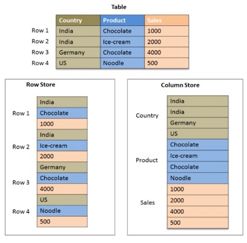

# dbt (Data Build Tool)

## Data Maturity Model

Data Collection > Data Wrangling > Data Integration > BI and Analytics > Artificial Intelligence  
### Data Integration

Write data from staging area to database.

### ETL vs ELT (Extract, Transform, Load)

* Data Warehouse: Source > Extract > Transform > Load  
* Data Lakehouse: Soruce > Extract > Load > Transform

## Data Storage

### Data Warehouse

A central repository of integrated data from one or more disparate sources. It is used to store structured data.

### Data Lake

Storage of unstructured data like Images and text files.

### Data Lakehouse

Data management like in a data warehouse, but data is stored cheap datalakes

## Data Stack

### SMP Warehouses (Symmetric Multi Procecessing)

Each processor is trated equally and runs in parallel with one another. The workload is evenly distributed when processing the program. Each processor shares the same resources. A single computer with multuple CPU cores.  
This architecture can only scale vertically.

### MPP Cloud Warehouse (Multi Parallel Processing)

Master node and compute nodes. Each processor has its own dedicated resources. Many computers work together.  

### Decoupling of Data and Storage

Comopute nodes are shut down, if not needed. Data persists.

### Column Oriented Databases

Row oriented databases are good in reading and writing data, but not efficient for analytical workloads.

### Modern Data Stack

