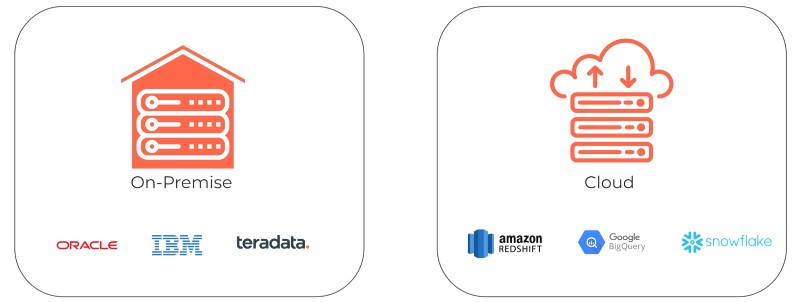

# dbt (Data Build Tool)

dbt: https://www.getdbt.com/
Snowflake: https://ns18238.us-east-2.aws.snowflakecomputing.com
Jinja: https://jinja.palletsprojects.com/en/3.1.x/

## Admin

### Install

    pip install virtualenv
    virtualenv venv
    
    source venv\Scripts\activate
    
### Check Structure

    dbt compile
    
### Create Models

    dbt run

## Data Maturity Model

Data Collection > Data Wrangling > Data Integration > BI and Analytics > Artificial Intelligence 

### Data Integration

Write data from staging area to database.

### ETL vs ELT (Extract, Transform, Load)

* Data Warehouse: Source > Extract > Transform > Load  
* Data Lakehouse: Soruce > Extract > Load > Transform

## Data Storage

### Data Warehouse

A central repository of integrated data from one or more disparate sources. It is used to store structured data.

### Data Lake

Storage of unstructured data like Images and text files.

### Data Lakehouse

Data management like in a data warehouse, but data is stored cheap datalakes

## SCDs Slowly Changing Dimensions

|Type|Desctiption|
|-|-|
|0|Not updating the DWH when a dimension changes|
|1|Overwrite original data|
|2|Add new row|
|3|Add new attribute|

## CTE Common Table Expression

    -- STEP 1
    with raw_listings as (
    
    -- STEP 2
        select * from [source] [listings]
    )
    
    -- STEP 3
    select * ftom raw_listings

## Data Stack

### SMP Warehouses (Symmetric Multi Procecessing)

Each processor is trated equally and runs in parallel with one another. The workload is evenly distributed when processing the program. Each processor shares the same resources. A single computer with multuple CPU cores.  
This architecture can only scale vertically.

### MPP Cloud Warehouse (Multi Parallel Processing)

Master node and compute nodes. Each processor has its own dedicated resources. Many computers work together.  

### Decoupling of Data and Storage

Comopute nodes are shut down, if not needed. Data persists.

### Column Oriented Databases

Row oriented databases are good in reading and writing data, but not efficient for analytical workloads.

### Modern Data Stack

## dbt Strucutres

### Materialization

### Seeds and Sources

* Seeds are local files that you upload to the dwh
* Sources are abstraction layers on th top of your input tables
</a>

#### Seeds

Copy csv file in 'seeds' folder

    dbt seed
    
#### Sources

Sources are abstractions of tables.

    with raw_reviews as (
        select * from {{source('airbnb','reviews')}}--AIRBNB.RAW.RAW_REVIEWS
    )
    
##### Data Freshness

Check, if data is current. Condigure freshness in 'sources.yml'

    sources:
      - name: airbnb
        schema: raw
        tables:
          - name: reviews
            identifier: raw_reviews
            loaded_at_field: date
            freshness:
              warn_after: {count: 1, period: hour}
              error_after: {count: 24, period: hour}
              
run command

    dbt source freshness

### Snapshots

