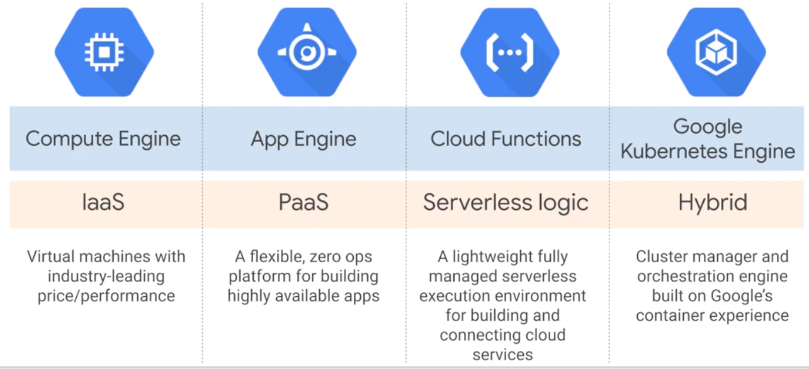
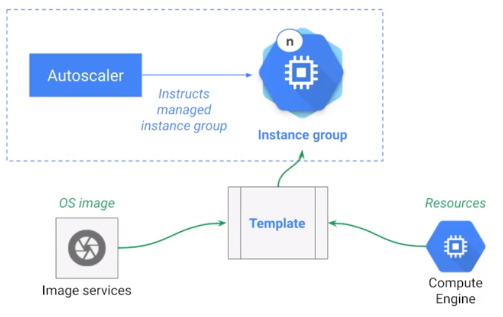
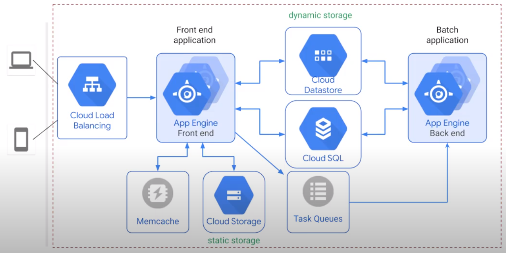
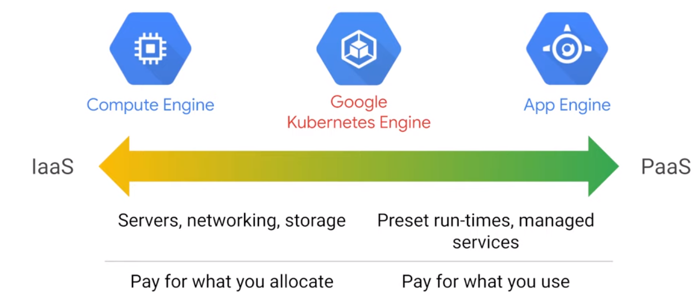

# Cloud Computing

## Cloud Shell

### General

    $ gcloud auth list
    $ gcloud config list project

### Set Zone

    $ gcloud config get-value compute/zone
    $ gcloud config get-value compute/region
  
    $ gcloud compute project-info describe --project qwiklabs-gcp-01-c87df1f33620
    $ export PROJECT_ID=qwiklabs-gcp-01-c87df1f33620
    $ export ZONE=europe-west1-d
  
## Create VM

### GUI

gcp > Compute Engine > VM Instances > Create Instance  
SSH into new VM

    $ sudo su
    $ apt-get update
    $ apt-get install -y nginx
    $ ps auwx | grep nginx

### Cloud Shell

    $ gcloud compute instances create gcelab2 --machine-type n1-standard-2 --zone $ZONE
  
### Help

    $ gcloud compute instances create --help
    
### Install new Component

    $ sudo apt-get install google-cloud-sdk
    $ gcloud beta interactive
    $ gcloud compute instances describe gcelab2
    
### Connect to VM with ssh

    $ gcloud compute ssh gcelab2 --zone $ZONE
    
### User Home directory

    $ cd $HOME
    $ vi ./.bashrc

## Compute Options

## Autoscaling

Provide ressources as needed

## App Engine

Provide fully managed environment > PAAS. App Enging has autoscaling.  

|Standard|Flexible|
|-|-|
|Fully-managed|Docker environment|
|Scale to zero|No Scale to zero|
|Changes limited|VMs exposed|

    $ cloud auth list
       
 gcp > API > library > App Engine Adimin API > enable
 
    $ gsutil -m cp -r gs://spls/gsp067/python-docs-samples .
    $ cd python-docs-samples/appengine/standard_python3/hello_world
    $ dev_appserver.py app.yaml
    
    $ gcloud app deploy
    $ gcloud app browse

## Cloud Functions

    $ mkdir gcf_hello_world
    $ cd gcf_hello_world
    
### Create function

    $ nano index.js
    
    /**
    * Background Cloud Function to be triggered by Pub/Sub.
    * This function is exported by index.js, and executed when
    * the trigger topic receives a message.
    *
    * @param {object} data The event payload.
    * @param {object} context The event metadata.
    */
    exports.helloWorld = (data, context) => {
    const pubSubMessage = data;
    const name = pubSubMessage.data
        ? Buffer.from(pubSubMessage.data, 'base64').toString() : "Hello World";
    console.log(`My Cloud Function: ${name}`);
    };
    
### Create Cloud Storage Bucket

    $ gsutil mb -p qwiklabs-gcp-04-fbbaef90a336 gs://qwiklabs-gcp-04-fbbaef90a336-bucket
    
### Deploy Function

    $ gcloud functions deploy helloWorld \
    --stage-bucket gs://qwiklabs-gcp-04-fbbaef90a336-bucket \
    --trigger-topic hello_world \
    --runtime nodejs8
    $ gcloud functions describe helloWorld
    
### Test Function 
    
    $ DATA=$(printf 'Hello World!'|base64) && gcloud functions call helloWorld --data '{"data":"'$DATA'"}'

### Read Logs

    $ gcloud functions logs read helloWorld
    
## Google Kubernetes Engine (GKE)

    $ gcloud auth list
    $ gcloud config list project
    $ gcloud config set compute/zone us-central1-a
    
### Create GKE Cluser

    $ gcloud container clusters create my-cluster
    
### Get Credentials

    $ gcloud container clusters get-credentials my-cluster
    
### Create Deployment

    $ kubectl create deployment hello-server --image=gcr.io/google-samples/hello-app:1.0
    
### Create Kubernetes Service

    $ kubectl expose deployment hello-server --type=LoadBalancer --port 8080
    $ kubectl get service
    
### Delete Cluster

    $ gcloud container clusters delete my-cluster
    
## Set Up Network Balancer

    $ gcloud auth list
    $ gcloud config list project
    $ gcloud config set compute/zone us-central1-a
    $ gcloud config set compute/region us-central1
    
### Create 3 VMs

    $ gcloud compute instances create www1 \
    --image-family debian-9 \
    --image-project debian-cloud \
    --zone us-central1-a \
    --tags network-lb-tag \
    --metadata startup-script="#! /bin/bash
    sudo apt-get update
    sudo apt-get install apache2 -y
    sudo service apache2 restart
    echo '<!doctype html><html><body><h1>www1</h1></body></html>' | tee /var/www/html/index.html"
    
    $ gcloud compute instances create www2 \
    --image-family debian-9 \
    --image-project debian-cloud \
    --zone us-central1-a \
    --tags network-lb-tag \
    --metadata startup-script="#! /bin/bash
    sudo apt-get update
    sudo apt-get install apache2 -y
    sudo service apache2 restart
    echo '<!doctype html><html><body><h1>www2</h1></body></html>' | tee /var/www/html/index.html"
    
    $ gcloud compute instances create www3 \
    --image-family debian-9 \
    --image-project debian-cloud \
    --zone us-central1-a \
    --tags network-lb-tag \
    --metadata startup-script="#! /bin/bash
    sudo apt-get update
    sudo apt-get install apache2 -y
    sudo service apache2 restart
    echo '<!doctype html><html><body><h1>www3</h1></body></html>' | tee /var/www/html/index.html"
    
### Create Firewall Rule

    $ gcloud compute firewall-rules create www-firewall-network-lb \
    --target-tags network-lb-tag --allow tcp:80
    
### Verify

    $ gcloud compute instances list
    $ curl http://[IP_ADDRESS]
    
### Configure Load Balancing Service

    $ gcloud compute addresses create network-lb-ip-1 \
    --region us-central1
    $ gcloud compute http-health-checks create basic-check
    $ gcloud compute target-pools create www-pool \
    --region us-central1 --http-health-check basic-check
    $ gcloud compute target-pools add-instances www-pool \
    --instances www1,www2,www3
    $ gcloud compute forwarding-rules create www-rule \
    --region us-central1 \
    --ports 80 \
    --address network-lb-ip-1 \
    --target-pool www-pool
    
### Send Traffic to Load Balancing Service

Get IP Address of Load Balancer

    $ gcloud compute forwarding-rules describe www-rule --region us-central1
    
Send Traffic
    
    $ while true; do curl -m1 34.122.157.81; done
    
## Set Up HTTP Load Balancer

### Create Load Balancer Template

    $ gcloud compute instance-templates create lb-backend-template \
    --region=us-central1 \
    --network=default \
    --subnet=default \
    --tags=allow-health-check \
    --image-family=debian-9 \
    --image-project=debian-cloud \
    --metadata=startup-script='#! /bin/bash
     apt-get update
     apt-get install apache2 -y
     a2ensite default-ssl
     a2enmod ssl
     vm_hostname="$(curl -H "Metadata-Flavor:Google" \
     http://169.254.169.254/computeMetadata/v1/instance/name)"
     echo "Page served from: $vm_hostname" | \
     tee /var/www/html/index.html
     systemctl restart apache2'
     
### Create Managed Instance Group

    $ gcloud compute instance-groups managed create lb-backend-group \
   --template=lb-backend-template --size=2 --zone=us-central1-a
   
### Create Firewall Rule

    $ gcloud compute firewall-rules create fw-allow-health-check \
    --network=default \
    --action=allow \
    --direction=ingress \
    --source-ranges=130.211.0.0/22,35.191.0.0/16 \
    --target-tags=allow-health-check \
    --rules=tcp:80
    
### Set Up Static IP Address

    $ gcloud compute addresses create lb-ipv4-1 \
    --ip-version=IPV4 \
    --global
    
Output: https://www.googleapis.com/compute/v1/projects/qwiklabs-gcp-01-022d93612fb0/global/addresses/lb-ipv4-1

### Create Health Check

    $ gcloud compute health-checks create http http-basic-check \
    --port 80
    
### Create Backend Service

    $ gcloud compute backend-services create web-backend-service \
    --protocol=HTTP \
    --port-name=http \
    --health-checks=http-basic-check \
    --global
    
### Add Instance Group to Backend Service

    $ gcloud compute backend-services add-backend web-backend-service \
    --instance-group=lb-backend-group \
    --instance-group-zone=us-central1-a \
    --global
    
### Create URL Map to Default Backend Service

    $ gcloud compute url-maps create web-map-http \
    --default-service web-backend-service
    
### Create Target Proxy to Route Requests to URL Map

    $ gcloud compute target-http-proxies create http-lb-proxy \
    --url-map web-map-http
    
### Create Forwarding Rule

    $ gcloud compute forwarding-rules create http-content-rule \
    --address=lb-ipv4-1\
    --global \
    --target-http-proxy=http-lb-proxy \
    --ports=80
    
 ### Verify
 
 gcp > Network Services > Load Balancing > Backend
