# BigQuery

* Serverless
* Flexible Pricing
* Data encryption
* Geospacial data
* Foundation for BI and AI
<a/>

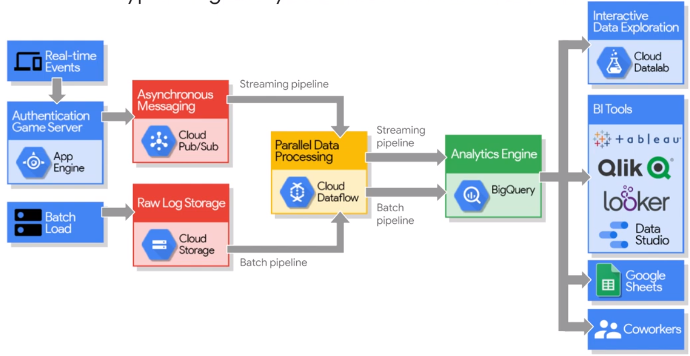

Computation time of 50 minutes down to 13 seconds!

Big Query combines data storage and the SQL engine.
  

  
You can load data direct into the SQL engine without uploading it into die Bigquery datastorage. 
  
## Dataprep
  
UI to explore dataset.
  
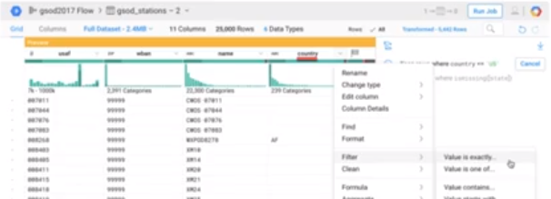
  
## Security
  
Viewer, Editor, Owner

## STRUCTs and ARRAYs

Structs are nested collections of columns. Arrays allow to split data cells in multiple records.

  
## GIS
  
GeoVIS

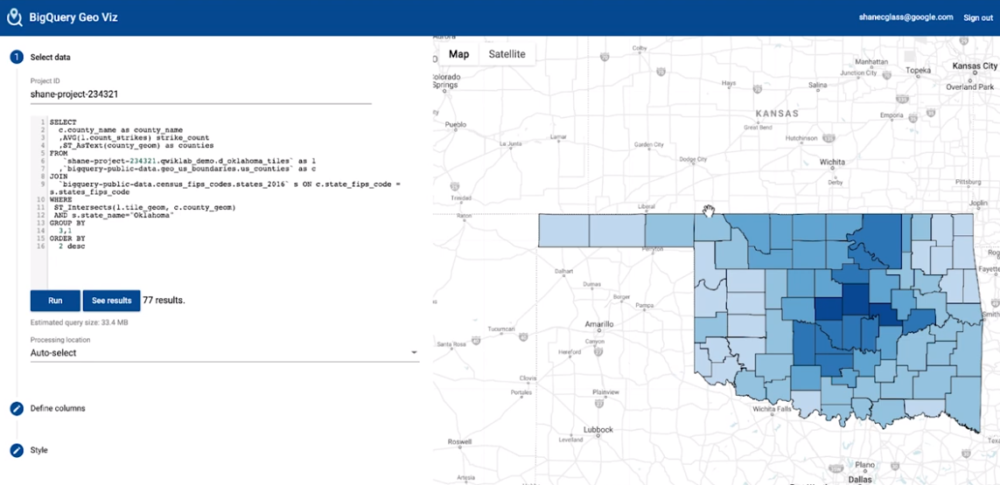
 
## Datasets
  
[Datasets](https://console.cloud.google.com/marketplace/browse?filter=solution-type:dataset)

## Machine Learning
           
ML features BigQuery:
* Write ML models in SQL
* Experiment and iterate right where your data lives
* Build classification and forecasting models
* Inspect model weights and adjust hyper parameters
           
Distribution of ML models

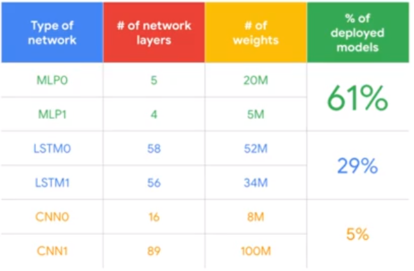

Types of ML models

### ML in BigQuery
           
ML Process in BigQuery:
* Dataset
* Create/Train
* Evaluate
* Predict/Classify

           
* Use Cluster to build Model
* Auto tune learning rate (alternatively set it maunually)
* Auto split training test (Random, Sequential, Custom)
* L1/L2 regularization

### ML.WEIGHTS

Show how usefull an item is to predict value.
           
### Overview
           
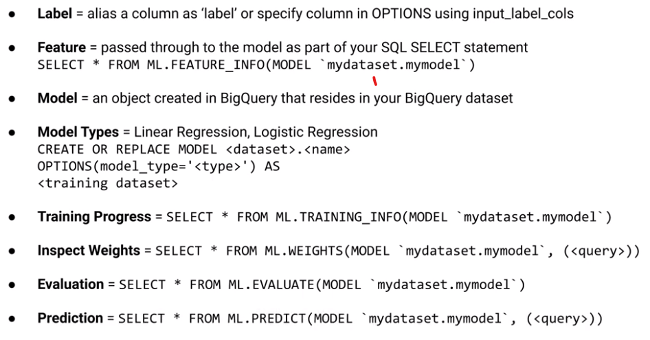

## Partitioning and Clustering

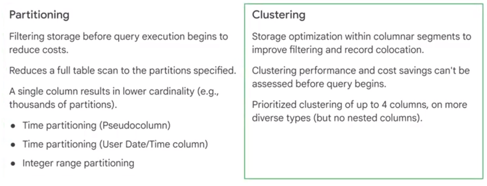

### Partitioning

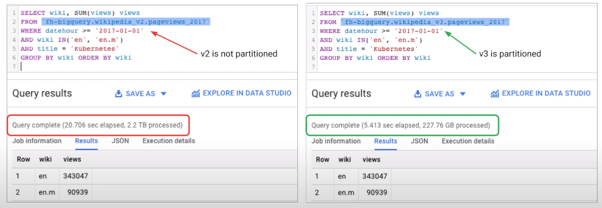  

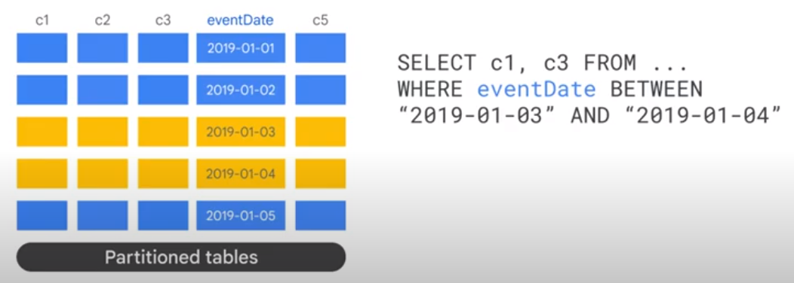  

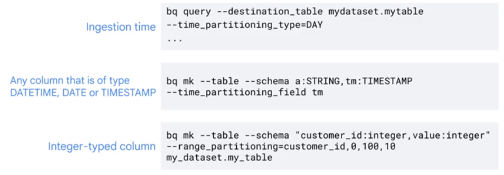  

### Clustering

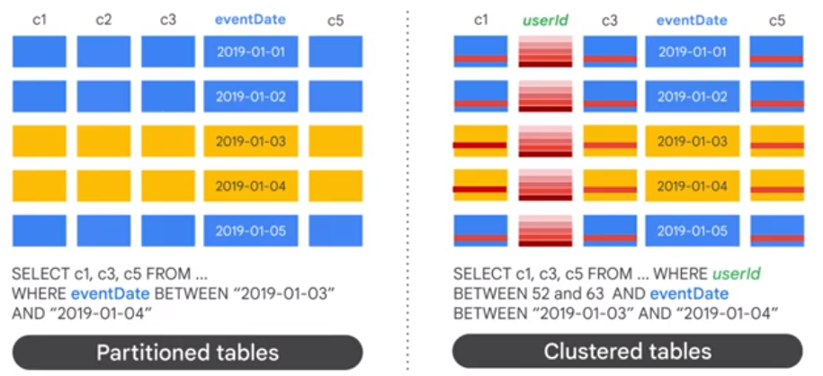  

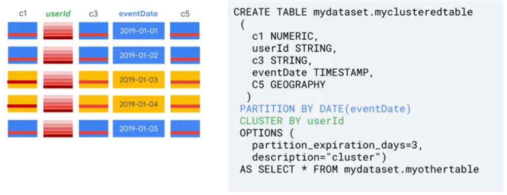  

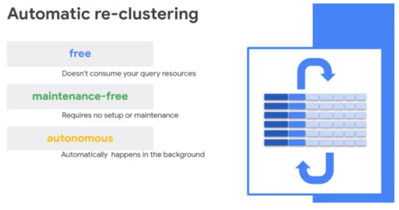

## Streaming

Streaming data is charged transaction.  

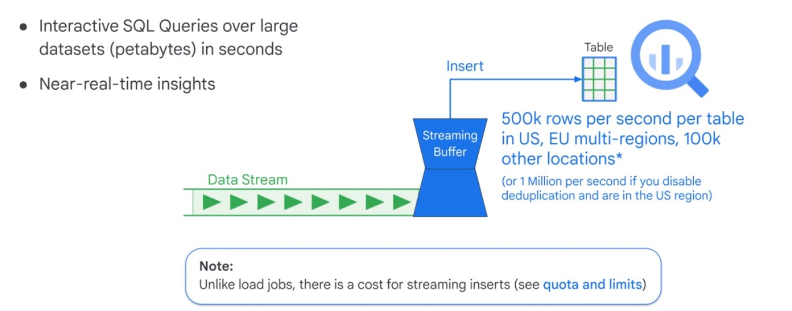

    $ export GOOGLE_APPLICATION_CREDENTIALS="/home/user/Downloads/[FILE_NAME].json"
    $ pip install google-cloud-bigquery
    
    from google.cloud import bigquery
    client = bigquery.Client(project='PROJECT_ID')
    
    dataset_ref = bigquery_client.dataset('my_dataset_id')
    table_ref = dataset_ref.table('my_dataset_id')
    table = bigquery_client.get_table(table_ref)
    
    to_to_insert = [
      (u'customer 1', 5),
      (u'customer 2', 17)
    ]
    
    errors = bigquery_client.insert_rows(table, rows_to_insert)

### Data Studio

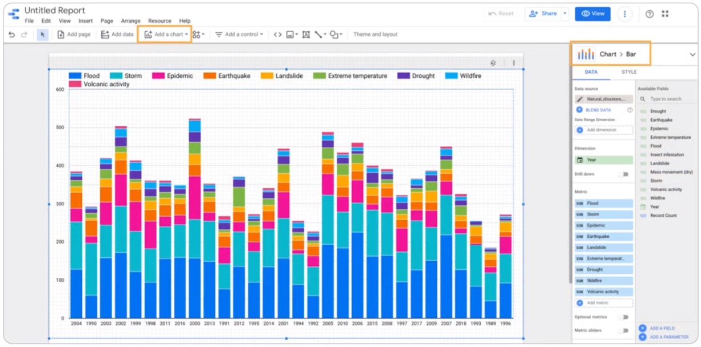  

### BI Engine

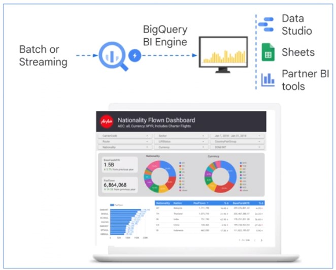

## Analytic Window Functions

* Standard aggregations
* Navigation functions
* Ranking and numbering functions
<a/>

### Navigation

* NTH_VALUE
* LAG
* FIRST_VALUE
* LAST_VALUE
<a/>

### Rank

    with
      longest_trips as (
        select
          start_station_id,
          duration,
          rank() over(partition by start_station_id order by duration desc) as nth_longest
        from
          `bigquery-public-data`.london_bicycles.cycle_hire
        )
      
      select
        start_station_id,
        array_agg (
          duration
          order by
            nth_longest
          limit
            3
          ) as durations
      from
        longest trips
      groub by
        start_station_id

* cume_dist
* dense_rank
* row_number
* percent_rank
<a/>

## GIS Functions

* ST_DWithin
* ST_GeogPoint
* ST_Intersects
<a/>

  

## Performance

