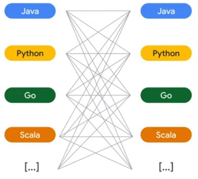

# Dataflow Foundations

## Apache Beam

* Programming model for bath and streaming data pipelines.
* Pipelines can run locally or other backend servers
* A Runner is used to execute you pipeline
<a/>

### Beam Portability

Provide portability framework for data pipelines.

* Portability Framework
* Language agnostic
* Interoperability layer = Portability API
* Docker containerization
<a/>

* Every runner works with every language
* Configurable worker environment
* Multi-language pipelines
* Cross-language transforms
* Faster delivery of new features
<a/>

### Dataflow Runner V2

### Container Environment

* Containerized with Docker
* Per-operation execution
<a/>

#### Custom Container

* Apache Beam SDK 2.25.0 or later
* Docker is required, to test pipeline locally

##### Create Dockerfile

    $ from apache/beam_python3.8_sdk:2.25.0
    $ env my_file_name=my_file.txt
    $ copy path/to/myfile/$MY_FILE_NAME ./
    
##### Build Image

    $ export PROJECT=my-project-id
    $ export REPO=my-repository
    $ export TAG=my-image-tag
    $ export REGISTRY_HOST=gcr.io
    $ export IMAGE_URI=$REGISTRY_HOST/$PROJECT/$REPO:$TAG
    
    $ gcloud builds submit --tag $IMAGE_URI
    
    $ docker build -f Dockerfile -t $IMAGE_URI ./
    $ docker push $IMAGE_URI
    
##### Launch Job

    $ python my-pipeline.py \
    --input=INPUT_FILE \
    --output=OUTPUT_FILE \
    --project=PROJECT_ID \
    --region=REGION \
    --temp_location=TEMP_LOCATION \
    --runner=DataflowRunner \
    --worker_harness_container_image=$IMAGE_URI
    
### Cross-Language Transforms

    from apache_beam.io.kafka import ReadFromKafka
    
    with beam.Pipeline(options=<You Beam PipelineOptions object>) as p:
      p
      | ReadFromKafka(
        consumer_config={'bootstrap.servers':'Kafka bootstrap servers list>'},
          topics=[<List of Kafka topics>])
    

## Separate Compute and Storage

Dataflow allows executing Apache Beam Pipelines on Google Cloud.

### Dataflow Shuffle Service

Only for Batch pipelines. Faster execution time.  

### Dataflow Streaming Engine

For Streaming Data pipelines. Less CPU and Memory.

### Flexible Resource Scheduling (FlexRS)

Reduce cost of batch processing pipelines
* Advanced scheduling
* Dataflow Shuffle service
* * Mix of preemptible and normal VMs
<a/>

Execution within 6 hours. For non-time critical workflows.

## IAM

### Job Submission

### Three Credentials

#### User roles

* Dataflow Viewer: Read-Only access to DF ressources
* Dataflow Developer: View, Update and Cancel DF jobs
* Dataflow Admin: Create and manage Dataflow jobs
<a/>

### Dataflow Service Account

* Interacts between project and Dataflow
* Used for worker creation and monitoring
* service-<project_number>@dataflow-service-producer-prod.iam.gserviceaccount.com
* Dataflow Agent role
<a/>

### Dataflow Controller Service Account

* Used by the workers to access resources needed by the pipeline
* <project-number>-compute@developer.gserviceaccount.com
<a/>
  

## Quotas
  
### CPU
  
Total number of CPUs consumed in a region.  

gcp > IAM > Quota.  
  
### IP
  
Total number of VMs with external IP address in a region.
  
### Persistent Disks
  
Either HDD, or SSD. set --worker_disk_type flag (pd-ssd).

#### Batch
  
* VM to PD ration is 1:1 for batch
* Size if Shuffle on VM: 250 GB
* Size if Shuffle Service: 25 GB
* Override default: --disk_size_gb
<a/>
  
#### Streaming

* Fixed numer of PD
* Default size if shuffle on VM: 400 GB
* Shuffle service: 30 GB
* Amount of disk allocated == Max number of workers
* --max_num_workers
<a/>

## Security
  
### Data Locality
  
Ensure all data and metadata stays in one region.
  
* Backend that deploys and controls Dataflow workers.
* Dataflow Service accound talks with regional endpoint.
* Stores and handles metadata about you DF job.
<a/>
  
#### Reasons for regional endpoint.

* Security and complience
* Min network latency and network transport costs
<a/>
  
* No zone preference: --region $REGION
* Specific region endpoint: --region $REGION -- worker_zone $WORKER_ZONE
<a/>
  
### Shared VPC (Virtual Private Cloud)
  
* Jobs can run in either VPC of Shared VPC
* Works for both default and custom networks
* Number of VMs is constrained by subnet IP block size
* Dataflow service account needs Compute Network User role in host project
<a/>
  

* --network default
  
## Private IPs
  
* Secure you data processing infrastructure
* Pipeline cannot access the internet and other Google Cloud networks
* Network must have Pricate Google Access to reach Google Cloud APIs and services
* --subnetwork regions/$REGION/subnetworks/$SUBNETWORK \
  --no_use_public_ips

## CMEK
  
Customer Managed Encryption Key. By default, Google manages key encryption. Customers can use symmetric CMEK keys stored in Google Cloud managed key service. Job metadata is encrypted with Google encryption.

* --temp_location gs://$BUCKET/tmpt/ \
  --dataflow_kms_key=projects/$PROJECT/locations/$REGION/keyRings/$KEY_RING/cryptoKeys/$KEY
</a>
