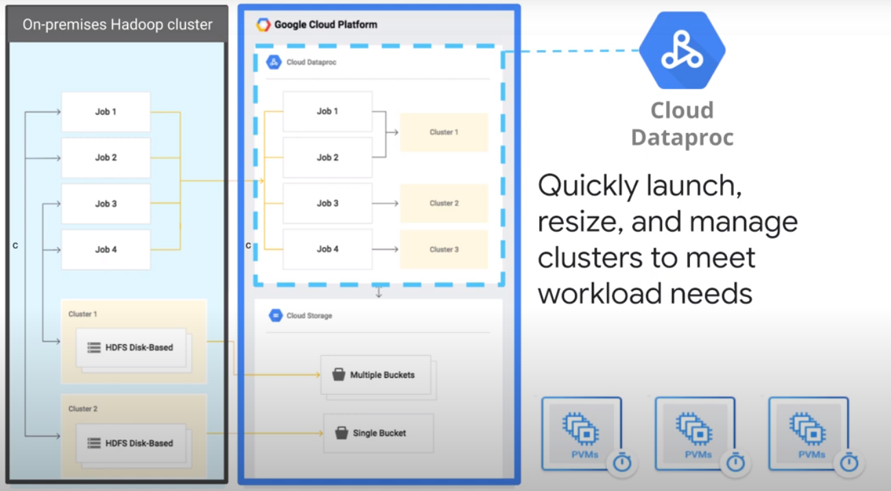
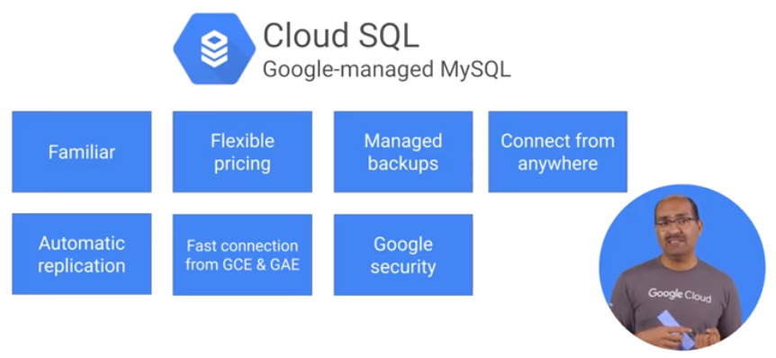
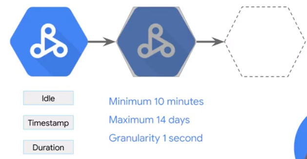
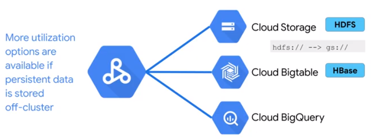

# Dataproc Introduction

Managed Hadoop, Spark ecosystem.

## Evolution Big Data Tools

## Transfer On-Premise to Google Cloud.
  

Store recommendations to Cloud SQL.

## Run Open Source Big Data Tools on Cloud Dataproc

Clusters are flexible ressources that can be used and destroyed on demand.

  

Do not store data in the cluster, to make autoscaling possible! Store data in google cloud storage.

# Execute Spark on Dataproc

## The Hadoop Ecosystem

On premise Hadoop clusters are not elastic. Dataproc simplifies Hadoop workloads.  

## Dataproc

* Built-in support Hadoop
* Managed hardware
* Version management
* Flexible jop configuration
<a/>

#### Key Features

* Low cost
* Super-fast
* Resizable clusters
* Open Source ecosystem
* Integrated
* Managed
* Versioning
* Highly available
* Developer tools
* Optional components
* Initialization actions
* Automatic/manual configuration
<a/>

### Initialization Actions

Use initialization actions to install additional components

    $ gcloud dataproc clusters create <CLUSTER_NAME> \
    --initialization-actions gs://$MY_BUCKET/hbase/hbase.sh \
    --num-masters 3 --num-workers 2
    
[Github Initialization Actions](https://github.com/GoogleCloudPlatform/dataproc-initialization-actions)

### Architecture

* Setup: Create cluster > Console, Cloud Console
* Configure: Cluster options, Primary node options, Worker nodes (2..n), Preemptlible nodes
* Optimize: Preemptlibe VM, Custom machine type, Custom image
* Utilize: Submit a job
* Monitor: Job driver output, Logs, Cloud monitoring
<a/>

### Cloud Storage vs Hadoop

* Block size (Hardware bound)
* Locality 8Hardware bound)
* Replication
<a/>

Cloud Storage is a drop-in replacement for HDFS.

* Cloud Storage has significant latency.
* Avoid iterating over many nested directories.
* Objects do not support 'append'
* Directories are simulated

### Compute, Storage separation

* Storage > Colossus
* Network > Jupyter (1 Pettabit network)
<a/>

Database > Hadoop > Cloud Services

### DistCp on-prem data that you always need

## Optimize Dataproc

* Where is data, where is cluster: Same region
* Is network traffic funneled?
* How many input files (not more than 10.000 files) > Larger file sizes
* Is the size of persistent disk limiting throughput
* Did you allocate enough virtual machines
<a/>

## Optimize Dataproc Storage

Local HDFS is good if:
* Jobs requite a lot of metadata operations
* You modify the HDFS data frequently, or rename directories
* You heavily use append operations
* Workloads with heavy I/O
* Workloads sensitive to latency
<a/>

Cloud Storage as initial and final datastore.

### Local HDFS

* Decrease total size of local HDFS by decreasing size of primary persistend disks
* Increase total size of local HDFS by increasing size of primary persistend disks
* Attach SSDs to each workers and use these disks for the HDFS
* Uase SSD persistend disks
<a/>

### Storage Options

* Cloud Storage
* Cloud Bigtable
* BigQuery
<a/>

## Ephemeral Clusters

  

### Replicating on-premise setup drawbacks

* Persistend clusters are expensive
* Open-spurce tools may be ineffiecient
* Persistent clusters are difficult to manage
<a/>

### Cluster Scheduled Deletion

Cluster is deleted automatically, if cluster gets in idle state.

### Persistent Clusters

## Dataproc Workflow Template

## Dataproc Autoscaling Workflow

Bases on YARN metrics. Does not scale to 0. Not for on-cluster HDFS

* Fine-grained controls
* Easy to understand
* Job stability
<a/>

### How Autoscaling Works

## Monitoring

    $ gcloud dataproc jobs submit hadoop --driver-log-levels
    $ spark.sparkContext.setLogLevel("DEBUG")

    
    
