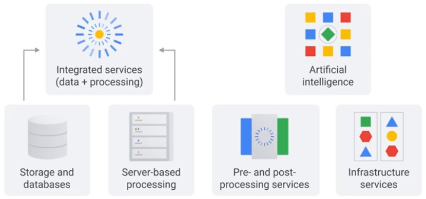
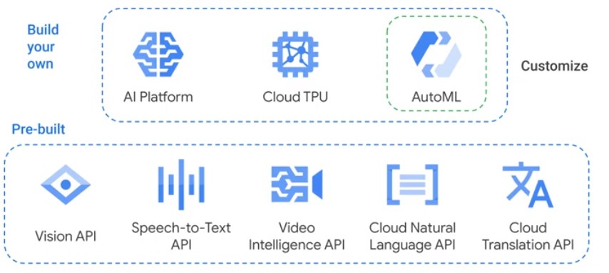
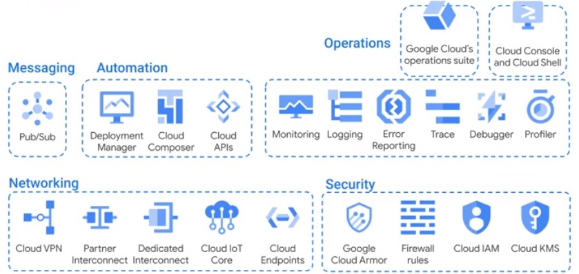
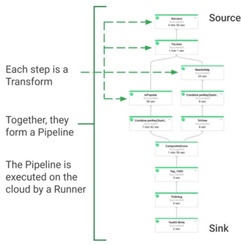
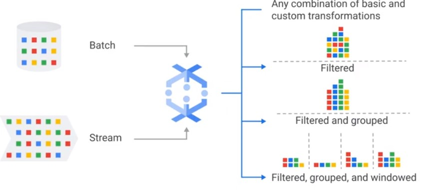

# Data Engineer Exam

[Data Engineer Exam Guide](https://cloud.google.com/certification/guides/data-engineer)  
[Google Cloud Documentation](https://cloud.google.com/docs/overview)

* Data Representation
* Pipelines
* Processing Infrastructure
<a/>

# Data Processing Systems

## Designing and building

### Data Processing Anatomy

### A view of data engineering on Google Cloud

  

### Storage and Databases

 

### Processing

### Data Processing Services

Combines storage and compute.  

#### Data Abstractions

|Service|Data Abstraction|Compute Abstraction|
|-|-|-|
|Dataproc, Spark|RDD|DAG|
|Bigquery|Table|Query|
|Dataflow|PCollection|Pipeline|

### Artificial Intelligence

### Pre- and Postpcocessing Services

### Infrastructure Services

## Design Flexible Data Representations

|Storage|Type|Stored in|
|-|-|-|
|Cloud Storage|Object|Bucket|
|Datastore|Property|Entity > Kind|
|Cloud SQL|Values|Rows and Columns > Table > Database|
|Cloud Spanner|Values|Rows and Columns > Tables > Database|

### Data in Files and Data in Transit

  

### Standard SQL Data Types

|Data type|Value|
|-|-|
|string|variable-length (unicode) character|
|int64|64-bit integer|
|float64|Double-precision decimal values|
|bool|true or false|
|array|ordered list of zero or more elements|
|struct|container of ordered fields|
|timestamp|represents an absolutej point in time|

### BigQuery Datasets, Tabnles and Jobs

* Project > Users and datasets
  * Limit access to datasets and jobs
  * Manage billing
* Dataset > Tables and views
  * Access Control Lists
  * Applied to all tables in the dataset
* Table > Collection of columns
  * Columnar storage
  * Views are virtual tables
  * Tables can be external
* Job > Potentially long-running action
  * Can be cancelled
<a/>

#### BigQuery is Columnar

### Spark hides Complexity in RDDs

RDDs hide complexity and allow making decisions on your behald. Manages: Location, Partition, Replication, Recovery, Pipelining ...

### Dataflow

#### PCollections

* Each step is a transformation
* All transformations are a pipeline
* Runner local, or in cloud
<a/>

* Each step is elastically scaled
* Each Transform is applied on a PCollection
* The result of an apply() is another PCollection
<a/>

#### Batch and stream processing

  

Bounded va Unbounded data. Dataflow uses windows to use streaming data. PCollections are not compatible with RDDs.

### Tensorflow

Opensource code for machine learning.  

## Design Data Pipelines

### Dataproc

* Cluster node options: Single node, Standard, High availability
* Benefits: Hadoop, Automated cluster management, Fast cluster resize
* HDFS: Use Cloud Storage for stateless solution
* HBASE: Use Cloud Bigtable for stateless solution
* Objective: Shut down the cluster, Restart per job
* Data storage: Dont't use hdfs
* Cloud storage: Match you data locatoin with the compute location
<a/>

#### Spark

Spark uses a DAG to process data. It executes commands only, if told to do so = "lazy evaluation" (oppostite "eager execution).

#### Dataproc can augment BigQuery

    projectId = <your-project-id>
    
    sql = "
      select
        n.year,
        n.month,
        n.day,
        n.weight_pounds
      from
        `bigquery-public-data.samples.natality` as n
      order by
        n.year
      limit 50"
      
    print "Running query ..."
    data = qbq.read_sql.gb1(sql,projectId=projectId)
    data[:5]

Extract data from BiqQuery using Dataproc and let Spark do the analysis.

#### Open Source Software

* Kafka > Pub/Sub
* HBASE > Cloud BigTable
* HDFS > Cloud BigStorage
<a/>

#### Initialization Actions

* Optional executable scripts
* Allow you to install additional components
* Provide common initialization actions on Github

#### Cluster Properties

* Allow you to modify properties in common configuration files like core-site.xml
* Remove the need to manually change property files
* Specified by file_prefix:property=value

### Dataflow Pipelines
 
