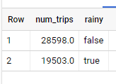
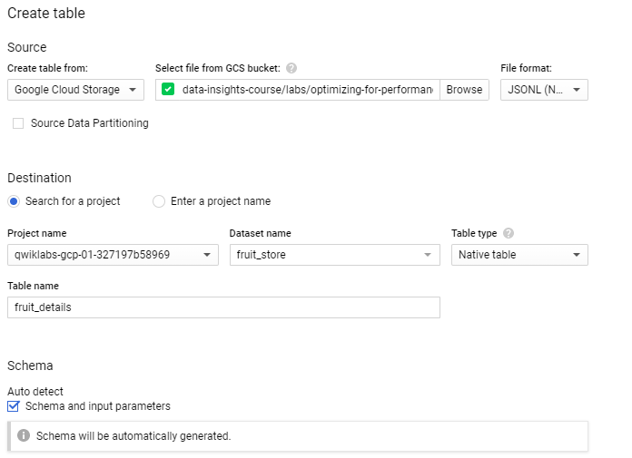
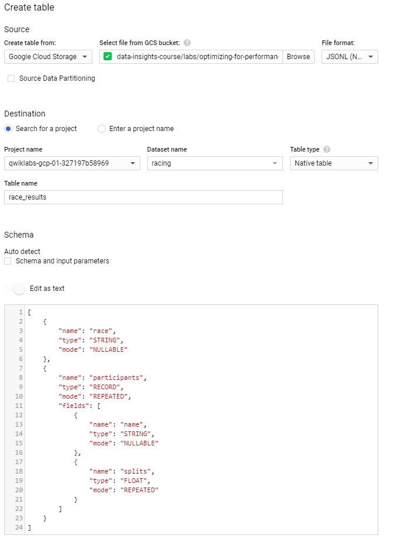

# Big Query

## Explore Datasets

gcp > BigQuery  
Add Data > Explore Public Datasets > NYC Bike  

    SELECT
      MIN(start_station_name) AS start_station_name,
      MIN(end_station_name) AS end_station_name,
      APPROX_QUANTILES(tripduration, 10)[OFFSET (5)] AS typical_duration,
      COUNT(tripduration) AS num_trips
    FROM
      `bigquery-public-data.new_york_citibike.citibike_trips`
    WHERE
      start_station_id != end_station_id
    GROUP BY
      start_station_id,
      end_station_id
    ORDER BY
      num_trips DESC
    LIMIT
      10
      
    WITH
      trip_distance AS (
    SELECT
      bikeid,
      ST_Distance(ST_GeogPoint(s.longitude,
          s.latitude),
        ST_GeogPoint(e.longitude,
          e.latitude)) AS distance
    FROM
      `bigquery-public-data.new_york_citibike.citibike_trips`,
      `bigquery-public-data.new_york_citibike.citibike_stations` as s,
      `bigquery-public-data.new_york_citibike.citibike_stations` as e
    WHERE
      start_station_id = s.station_id
      AND end_station_id = e.station_id )
    SELECT
      bikeid,
      SUM(distance)/1000 AS total_distance
    FROM
      trip_distance
    GROUP BY
      bikeid
    ORDER BY
      total_distance DESC
    LIMIT
      5
      
ghcn_d > ghcnd_2015
  
    SELECT
      wx.date,
      wx.value/10.0 AS prcp
    FROM
      `bigquery-public-data.ghcn_d.ghcnd_2015` AS wx
    WHERE
      id = 'USW00094728'
      AND qflag IS NULL
      AND element = 'PRCP'
    ORDER BY
      wx.date
      
 ## Join Tables > Correlation Weather Bike Travels
 
    WITH bicycle_rentals AS (
      SELECT
        COUNT(starttime) as num_trips,
        EXTRACT(DATE from starttime) as trip_date
      FROM `bigquery-public-data.new_york_citibike.citibike_trips`
      GROUP BY trip_date
    ),
    rainy_days AS
    (
    SELECT
      date,
      (MAX(prcp) > 5) AS rainy
    FROM (
      SELECT
        wx.date AS date,
        IF (wx.element = 'PRCP', wx.value/10, NULL) AS prcp
      FROM
        `bigquery-public-data.ghcn_d.ghcnd_2015` AS wx
      WHERE
        wx.id = 'USW00094728'
    )
    GROUP BY
      date
    )
    SELECT
      ROUND(AVG(bk.num_trips)) AS num_trips,
      wx.rainy
    FROM bicycle_rentals AS bk
    JOIN rainy_days AS wx
    ON wx.date = bk.trip_date
    GROUP BY wx.rainy
    
 
 
## Load Data

### Create Dataset

gcp > BigQuery  
Project > Create Dataset > nyctaxi  

### Ingest Dataset from CSV

nyctaxi > Create Table > 2018trips > Upload, File, csv, Autodetect Schema

    #standardSQL
    SELECT
      *
    FROM
      nyctaxi.2018trips
    ORDER BY
      fare_amount DESC
    LIMIT  5
    
### Ingest Dataset from Google Cloud Storage

    $ bq load \
    --source_format=CSV \
    --autodetect \
    --noreplace  \
    nyctaxi.2018trips \
    gs://cloud-training/OCBL013/nyc_tlc_yellow_trips_2018_subset_2.csv
    
### Create Tables from other Tables

    #standardSQL
    CREATE TABLE
      nyctaxi.january_trips AS
    SELECT
      *
    FROM
      nyctaxi.2018trips
    WHERE
      EXTRACT(Month
      FROM
        pickup_datetime)=1;
        
    #standardSQL
    SELECT
      *
    FROM
      nyctaxi.january_trips
    ORDER BY
      trip_distance DESC
    LIMIT
      1

# JSON and ARRAY Data

gcp > BigQuery > Project > Create Dataset > fruit_store  

    #standardSQL
    SELECT
    ['raspberry', 'blackberry', 'strawberry', 'cherry'] AS fruit_array;

    #standardSQL
    SELECT person, fruit_array, total_cost FROM `data-to-insights.advanced.fruit_store`;
    
JSON

    [
      {
        "person": [
          "sally"
        ],
        "fruit_array": [
          "raspberry",
          "blackberry",
          "strawberry",
          "cherry"
        ],
        "total_cost": [
          "10.99"
        ]
      },
      {
        "person": [
          "frederick"
        ],
        "fruit_array": [
          "orange",
          "apple"
        ],
        "total_cost": [
          "5.55"
        ]
      }
    ]

Project > fruit_store > Create Table > fruit_details  

## Create own Arrays

    SELECT
      fullVisitorId,
      date,
      v2ProductName,
      pageTitle
      FROM `data-to-insights.ecommerce.all_sessions`
    WHERE visitId = 1501570398
    ORDER BY date;

    SELECT
      fullVisitorId,
      date,
      ARRAY_AGG(v2ProductName) AS products_viewed,
      ARRAY_AGG(pageTitle) AS pages_viewed
      FROM `data-to-insights.ecommerce.all_sessions`
    WHERE visitId = 1501570398
    GROUP BY fullVisitorId, date
    ORDER BY date;
    
    SELECT
      fullVisitorId,
      date,
      ARRAY_AGG(v2ProductName) AS products_viewed,
      ARRAY_LENGTH(ARRAY_AGG(v2ProductName)) AS num_products_viewed,
      ARRAY_AGG(pageTitle) AS pages_viewed,
      ARRAY_LENGTH(ARRAY_AGG(pageTitle)) AS num_pages_viewed
      FROM `data-to-insights.ecommerce.all_sessions`
    WHERE visitId = 1501570398
    GROUP BY fullVisitorId, date
    ORDER BY date;
    
    SELECT
      fullVisitorId,
      date,
      ARRAY_AGG(DISTINCT v2ProductName) AS products_viewed,
      ARRAY_LENGTH(ARRAY_AGG(DISTINCT v2ProductName)) AS distinct_products_viewed,
      ARRAY_AGG(DISTINCT pageTitle) AS pages_viewed,
      ARRAY_LENGTH(ARRAY_AGG(DISTINCT pageTitle)) AS distinct_pages_viewed
      FROM `data-to-insights.ecommerce.all_sessions`
    WHERE visitId = 1501570398
    GROUP BY fullVisitorId, date
    ORDER BY date;
    
## Query Datasets with ARRAYs

    SELECT
      *
    FROM `bigquery-public-data.google_analytics_sample.ga_sessions_20170801`
    WHERE visitId = 1501570398;
    
    SELECT DISTINCT
      visitId,
      h.page.pageTitle
    FROM `bigquery-public-data.google_analytics_sample.ga_sessions_20170801`,
    UNNEST(hits) AS h
    WHERE visitId = 1501570398
    LIMIT 10;

## STRUCTs

    SELECT
      visitId,
      totals.*,
      device.*
    FROM `bigquery-public-data.google_analytics_sample.ga_sessions_20170801`
    WHERE visitId = 1501570398
    LIMIT 10;
    
## Practice ARRAYs

    #standardSQL
    SELECT STRUCT("Rudisha" as name, 23.4 as split) as runner
    
    #standardSQL
    SELECT STRUCT("Rudisha" as name, [23.4, 26.3, 26.4, 26.1] as splits) AS runner
    
    #standardSQL
    SELECT
      p.name,
      SUM(split_times) as total_race_time
    FROM racing.race_results AS r
    , UNNEST(r.participants) AS p
    , UNNEST(p.splits) AS split_times
    WHERE p.name LIKE 'R%'
    GROUP BY p.name
    ORDER BY total_race_time ASC;
    
    #standardSQL
    SELECT
      p.name,
      split_time
    FROM racing.race_results AS r
    , UNNEST(r.participants) AS p
    , UNNEST(p.splits) AS split_time
    WHERE split_time = 23.2;

## Ingest JSON Data

gcp > BigQuery > Project > Create Dataset > racing  
racing > Create Table > race_results  

  

    #standardSQL
    SELECT * FROM racing.race_results;
    
    #standardSQL
    SELECT race, participants.name
    FROM racing.race_results
    CROSS JOIN
    race_results.participants # full STRUCT name;
    
    #standardSQL
    SELECT race, participants.name
    FROM racing.race_results AS r, r.participants;
    
## Practice STRUCTs

    #standardSQL
    SELECT COUNT(p.name) AS racer_count
    FROM racing.race_results AS r, UNNEST(r.participants) AS p
    
    
