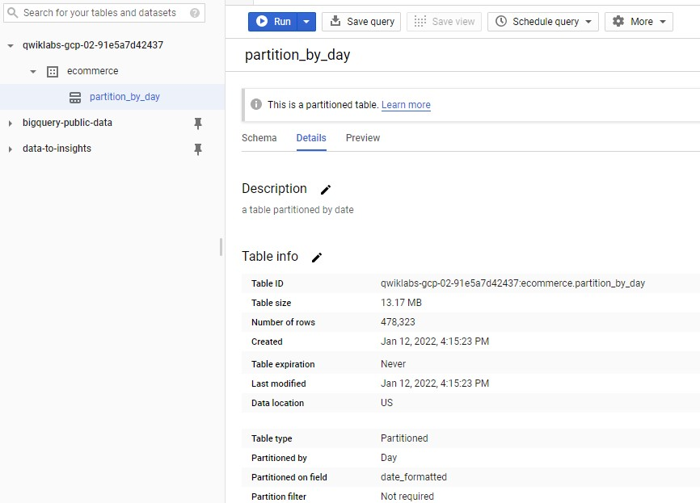

# Partitioning Tables

gcp > BigQuery > Project > Create Dataset > ecommerce  

## Create Table with Date Partition

    #standardSQL
    SELECT DISTINCT
      fullVisitorId,
      date,
      city,
      pageTitle
    FROM `data-to-insights.ecommerce.all_sessions_raw`
    WHERE date = '20170708'
    LIMIT 5;
    
    #standardSQL
    SELECT DISTINCT
      fullVisitorId,
      date,
      city,
      pageTitle
    FROM `data-to-insights.ecommerce.all_sessions_raw`
    WHERE date = '20180708'
    LIMIT 5;

The query engine has the metadata for each partition stored but still needs to scan all records even if the table is partitioned. Before the query runs, the query engine does not know whether 2018 data exists to satisfy the WHERE clause condition and it needs to scan through all records in a non-partitioned table.  

    #standardSQL
    CREATE OR REPLACE TABLE ecommerce.partition_by_day
    PARTITION BY date_formatted
    OPTIONS(
     description="a table partitioned by date"
    ) AS
    SELECT DISTINCT
    PARSE_DATE("%Y%m%d", date) AS date_formatted,
    fullvisitorId
    FROM `data-to-insights.ecommerce.all_sessions_raw`;
    

    #standardSQL
    SELECT *
    FROM `data-to-insights.ecommerce.partition_by_day`
    WHERE date_formatted = '2016-08-01';
    
    #standardSQL
    SELECT *
    FROM `data-to-insights.ecommerce.partition_by_day`
    WHERE date_formatted = '2018-07-08';
    
## Create Auto-Expiring Partitioned Table

    #standardSQL
    SELECT
     DATE(CAST(year AS INT64), CAST(mo AS INT64), CAST(da AS INT64)) AS date,
     (SELECT ANY_VALUE(name) FROM `bigquery-public-data.noaa_gsod.stations` AS stations
      WHERE stations.usaf = stn) AS station_name,  -- Stations may have multiple names
     prcp
    FROM `bigquery-public-data.noaa_gsod.gsod*` AS weather
    WHERE prcp < 99.9  -- Filter unknown values
     AND prcp > 0      -- Filter stations/days with no precipitation
     AND _TABLE_SUFFIX >= '2021'
    ORDER BY date DESC -- Where has it rained/snowed recently
    LIMIT 10;
    
    #standardSQL
    CREATE OR REPLACE TABLE ecommerce.days_with_rain
    PARTITION BY date
    OPTIONS (
     partition_expiration_days=60,
     description="weather stations with precipitation, partitioned by day"
    ) AS
    SELECT
     DATE(CAST(year AS INT64), CAST(mo AS INT64), CAST(da AS INT64)) AS date,
     (SELECT ANY_VALUE(name) FROM `bigquery-public-data.noaa_gsod.stations` AS stations
      WHERE stations.usaf = stn) AS station_name,  -- Stations may have multiple names
     prcp
    FROM `bigquery-public-data.noaa_gsod.gsod*` AS weather
    WHERE prcp < 99.9  -- Filter unknown values
     AND prcp > 0      -- Filter
     AND _TABLE_SUFFIX >= '2021';

    #standardSQL
    # avg monthly precipitation
    SELECT
      AVG(prcp) AS average,
      station_name,
      date,
      CURRENT_DATE() AS today,
      DATE_DIFF(CURRENT_DATE(), date, DAY) AS partition_age,
      EXTRACT(MONTH FROM date) AS month
    FROM ecommerce.days_with_rain
    WHERE station_name = 'WAKAYAMA' #Japan
    GROUP BY station_name, date, today, month, partition_age
    ORDER BY date DESC; # most recent days first;
    
    #standardSQL
    # avg monthly precipitation
    SELECT
      AVG(prcp) AS average,
      station_name,
      date,
      CURRENT_DATE() AS today,
      DATE_DIFF(CURRENT_DATE(), date, DAY) AS partition_age,
      EXTRACT(MONTH FROM date) AS month
    FROM ecommerce.days_with_rain
    WHERE station_name = 'WAKAYAMA' #Japan
    GROUP BY station_name, date, today, month, partition_age
    ORDER BY partition_age DESC;
    
    
