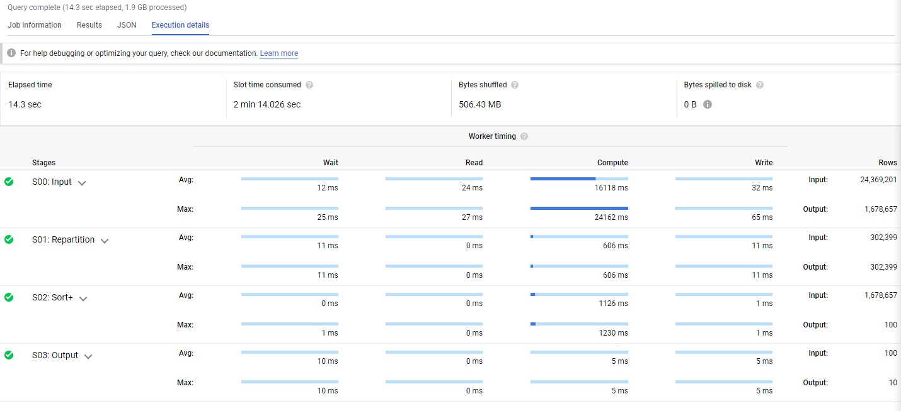
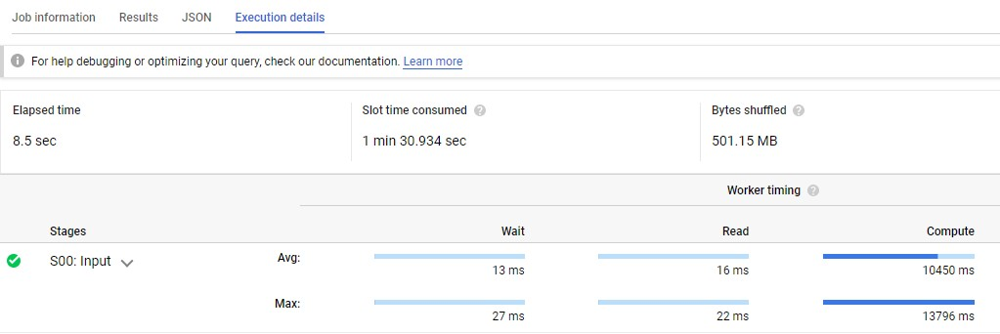

# Optimize BigQuery Performance

gcp > BigQuery  

## Be purposeful with the Select Statement

1 sec, 371.8 MB Data:

    SELECT
      bike_id,
      duration
    FROM
      `bigquery-public-data`.london_bicycles.cycle_hire
    ORDER BY
      duration DESC
    LIMIT
      1;

3.3 sec, 2600 MB Data:

    SELECT
      *
    FROM
      `bigquery-public-data`.london_bicycles.cycle_hire
    ORDER BY
      duration DESC
    LIMIT
      1;
      
## Reduce Data beeing read

    SELECT
      MIN(start_station_name) AS start_station_name,
      MIN(end_station_name) AS end_station_name,
      APPROX_QUANTILES(duration, 10)[OFFSET (5)] AS typical_duration,
      COUNT(duration) AS num_trips
    FROM
      `bigquery-public-data`.london_bicycles.cycle_hire
    WHERE
      start_station_id != end_station_id
    GROUP BY
      start_station_id,
      end_station_id
    ORDER BY
      num_trips DESC
    LIMIT
      10;
      
Execution Details:  
 

 
    SELECT
      start_station_name,
      end_station_name,
      APPROX_QUANTILES(duration, 10)[OFFSET(5)] AS typical_duration,
      COUNT(duration) AS num_trips
    FROM
      `bigquery-public-data`.london_bicycles.cycle_hire
    WHERE
      start_station_name != end_station_name
    GROUP BY
      start_station_name,
      end_station_name
    ORDER BY
      num_trips DESC
    LIMIT
      10;
      

## Reduce Number of expensive Calculations

6.8 sec, Shuffle 1.22 MB

    WITH
      trip_distance AS (
    SELECT
      bike_id,
      ST_Distance(ST_GeogPoint(s.longitude,
          s.latitude),
        ST_GeogPoint(e.longitude,
          e.latitude)) AS distance
    FROM
      `bigquery-public-data`.london_bicycles.cycle_hire,
      `bigquery-public-data`.london_bicycles.cycle_stations s,
      `bigquery-public-data`.london_bicycles.cycle_stations e
    WHERE
      start_station_id = s.id
      AND end_station_id = e.id )
    SELECT
      bike_id,
      SUM(distance)/1000 AS total_distance
    FROM
      trip_distance
    GROUP BY
      bike_id
    ORDER BY
      total_distance DESC
    LIMIT
      5;
      
4.8 sec, Shuffle 33.21 MB
 
    WITH
      stations AS (
    SELECT
      s.id AS start_id,
      e.id AS end_id,
      ST_Distance(ST_GeogPoint(s.longitude,
          s.latitude),
        ST_GeogPoint(e.longitude,
          e.latitude)) AS distance
    FROM
      `bigquery-public-data`.london_bicycles.cycle_stations s,
      `bigquery-public-data`.london_bicycles.cycle_stations e ),
    trip_distance AS (
    SELECT
      bike_id,
      distance
    FROM
      `bigquery-public-data`.london_bicycles.cycle_hire,
      stations
    WHERE
      start_station_id = start_id
      AND end_station_id = end_id )
    SELECT
      bike_id,
      SUM(distance)/1000 AS total_distance
    FROM
      trip_distance
    GROUP BY
      bike_id
    ORDER BY
      total_distance DESC
    LIMIT
      5;

## Cache Results of previous Queries

Project > Create Dataset > mydataset  

    CREATE OR REPLACE TABLE
      mydataset.typical_trip AS
    SELECT
      start_station_name,
      end_station_name,
      APPROX_QUANTILES(duration, 10)[OFFSET (5)] AS typical_duration,
      COUNT(duration) AS num_trips
    FROM
      `bigquery-public-data`.london_bicycles.cycle_hire
    GROUP BY
      start_station_name,
      end_station_name;

### Use Cache Table

    SELECT
      EXTRACT (DATE
      FROM
        start_date) AS trip_date,
      APPROX_QUANTILES(duration / typical_duration, 10)[OFFSET(5)] AS ratio,
      COUNT(*) AS num_trips_on_day
    FROM
      `bigquery-public-data`.london_bicycles.cycle_hire AS hire
    JOIN
      mydataset.typical_trip AS trip
    ON
      hire.start_station_name = trip.start_station_name
      AND hire.end_station_name = trip.end_station_name
      AND num_trips > 10
    GROUP BY
      trip_date
    HAVING
      num_trips_on_day > 10
    ORDER BY
      ratio DESC
    LIMIT
      10;

    WITH
      typical_trip AS (
      SELECT
        start_station_name,
        end_station_name,
        APPROX_QUANTILES(duration, 10)[OFFSET (5)] AS typical_duration,
        COUNT(duration) AS num_trips
      FROM
        `bigquery-public-data`.london_bicycles.cycle_hire
      GROUP BY
        start_station_name,
        end_station_name )
      SELECT
        EXTRACT (DATE
        FROM
          start_date) AS trip_date,
        APPROX_QUANTILES(duration / typical_duration, 10)[
      OFFSET
        (5)] AS ratio,
        COUNT(*) AS num_trips_on_day
      FROM
        `bigquery-public-data`.london_bicycles.cycle_hire AS hire
      JOIN
        typical_trip AS trip
      ON
        hire.start_station_name = trip.start_station_name
        AND hire.end_station_name = trip.end_station_name
        AND num_trips > 10
      GROUP BY
        trip_date
      HAVING
        num_trips_on_day > 10
      ORDER BY
        ratio DESC
      LIMIT
      10;

## Efficient Joins

### Denormalization

    CREATE OR REPLACE TABLE
      mydataset.london_bicycles_denorm AS
    SELECT
      start_station_id,
      s.latitude AS start_latitude,
      s.longitude AS start_longitude,
      end_station_id,
      e.latitude AS end_latitude,
      e.longitude AS end_longitude
    FROM
      `bigquery-public-data`.london_bicycles.cycle_hire AS h
    JOIN
      `bigquery-public-data`.london_bicycles.cycle_stations AS s
    ON
      h.start_station_id = s.id
    JOIN
      `bigquery-public-data`.london_bicycles.cycle_stations AS e
    ON
      h.end_station_id = e.id;

### Avoid Self-Joins

    SELECT
      name,
      number AS num_babies
    FROM
      `bigquery-public-data`.usa_names.usa_1910_current
    WHERE
      gender = 'M'
      AND year = 2015
      AND state = 'MA'
    ORDER BY
      num_babies DESC
    LIMIT
      5;

    WITH
    male_babies AS (
    SELECT
      name,
      number AS num_babies
    FROM
      `bigquery-public-data`.usa_names.usa_1910_current
    WHERE
      gender = 'M' ),
    female_babies AS (
    SELECT
      name,
      number AS num_babies
    FROM
      `bigquery-public-data`.usa_names.usa_1910_current
    WHERE
      gender = 'F' ),
    both_genders AS (
    SELECT
      name,
      SUM(m.num_babies) + SUM(f.num_babies) AS num_babies,
      SUM(m.num_babies) / (SUM(m.num_babies) + SUM(f.num_babies)) AS frac_male
    FROM
      male_babies AS m
    JOIN
      female_babies AS f
    USING
      (name)
    GROUP BY
      name )
    SELECT
      *
    FROM
      both_genders
    WHERE
      frac_male BETWEEN 0.3
      AND 0.7
    ORDER BY
      num_babies DESC
    LIMIT
      5;
      
Avoid Self-Join:

    WITH
    all_babies AS (
    SELECT
      name,
      SUM(
      IF
        (gender = 'M',
          number,
          0)) AS male_babies,
      SUM(
      IF
        (gender = 'F',
          number,
          0)) AS female_babies
    FROM
      `bigquery-public-data.usa_names.usa_1910_current`
    GROUP BY
      name ),
    both_genders AS (
    SELECT
      name,
      (male_babies + female_babies) AS num_babies,
      SAFE_DIVIDE(male_babies,
        male_babies + female_babies) AS frac_male
    FROM
      all_babies
    WHERE
      male_babies > 0
      AND female_babies > 0 )
    SELECT
      *
    FROM
      both_genders
    WHERE
      frac_male BETWEEN 0.3
      AND 0.7
    ORDER BY
      num_babies DESC
    LIMIT
      5;

### Reduce Data beeing loaded

    WITH
    all_names AS (
    SELECT
      name,
      gender,
      SUM(number) AS num_babies
    FROM
      `bigquery-public-data`.usa_names.usa_1910_current
    GROUP BY
      name,
      gender ),
    male_names AS (
    SELECT
      name,
      num_babies
    FROM
      all_names
    WHERE
      gender = 'M' ),
    female_names AS (
    SELECT
      name,
      num_babies
    FROM
      all_names
    WHERE
      gender = 'F' ),
    ratio AS (
    SELECT
      name,
      (f.num_babies + m.num_babies) AS num_babies,
      m.num_babies / (f.num_babies + m.num_babies) AS frac_male
    FROM
      male_names AS m
    JOIN
      female_names AS f
    USING
      (name) )
    SELECT
      *
    FROM
      ratio
    WHERE
      frac_male BETWEEN 0.3
      AND 0.7
    ORDER BY
      num_babies DESC
    LIMIT
      5;
      
### Use Window-Function instead of Self-Join

    SELECT
      bike_id,
      start_date,
      end_date,
      TIMESTAMP_DIFF( start_date, LAG(end_date) OVER (PARTITION BY bike_id ORDER BY start_date), SECOND) AS time_at_station
    FROM
      `bigquery-public-data`.london_bicycles.cycle_hire
    LIMIT
       5;

    WITH
    unused AS (
      SELECT
        bike_id,
        start_station_name,
        start_date,
        end_date,
        TIMESTAMP_DIFF(start_date, LAG(end_date) OVER (PARTITION BY bike_id ORDER BY start_date), SECOND) AS time_at_station
      FROM
        `bigquery-public-data`.london_bicycles.cycle_hire )
    SELECT
      start_station_name,
      AVG(time_at_station) AS unused_seconds
    FROM
      unused
    GROUP BY
      start_station_name
    ORDER BY
      unused_seconds ASC
    LIMIT
      5;

### Join with Pre-computed Values

    WITH
      denormalized_table AS (
      SELECT
        start_station_name,
        end_station_name,
        ST_DISTANCE(ST_GeogPoint(s1.longitude,
            s1.latitude),
          ST_GeogPoint(s2.longitude,
            s2.latitude)) AS distance,
        duration
      FROM
        `bigquery-public-data`.london_bicycles.cycle_hire AS h
      JOIN
        `bigquery-public-data`.london_bicycles.cycle_stations AS s1
      ON
        h.start_station_id = s1.id
      JOIN
        `bigquery-public-data`.london_bicycles.cycle_stations AS s2
      ON
        h.end_station_id = s2.id ),
      durations AS (
      SELECT
        start_station_name,
        end_station_name,
        MIN(distance) AS distance,
        AVG(duration) AS duration,
        COUNT(*) AS num_rides
      FROM
        denormalized_table
      WHERE
        duration > 0
        AND distance > 0
      GROUP BY
        start_station_name,
        end_station_name
      HAVING
        num_rides > 100 )
    SELECT
      start_station_name,
      end_station_name,
      distance,
      duration,
      duration/distance AS pace
    FROM
      durations
    ORDER BY
      pace ASC
    LIMIT
      5;

    WITH
      distances AS (
      SELECT
        a.id AS start_station_id,
        a.name AS start_station_name,
        b.id AS end_station_id,
        b.name AS end_station_name,
        ST_DISTANCE(ST_GeogPoint(a.longitude,
            a.latitude),
          ST_GeogPoint(b.longitude,
            b.latitude)) AS distance
      FROM
        `bigquery-public-data`.london_bicycles.cycle_stations a
      CROSS JOIN
        `bigquery-public-data`.london_bicycles.cycle_stations b
      WHERE
        a.id != b.id ),
      durations AS (
      SELECT
        start_station_id,
        end_station_id,
        AVG(duration) AS duration,
        COUNT(*) AS num_rides
      FROM
        `bigquery-public-data`.london_bicycles.cycle_hire
      WHERE
        duration > 0
      GROUP BY
        start_station_id,
        end_station_id
      HAVING
        num_rides > 100 )
    SELECT
      start_station_name,
      end_station_name,
      distance,
      duration,
      duration/distance AS pace
    FROM
      distances
    JOIN
      durations
    USING
      (start_station_id,
        end_station_id)
    ORDER BY
      pace ASC
    LIMIT
      5;

## Avoid Overwhelming Worker

### Limit Large Sorts

    SELECT
      rental_id,
      ROW_NUMBER() OVER(ORDER BY end_date) AS rental_number
    FROM
      `bigquery-public-data.london_bicycles.cycle_hire`
    ORDER BY
      rental_number ASC
    LIMIT
      5;
      
    WITH
      rentals_on_day AS (
      SELECT
        rental_id,
        end_date,
        EXTRACT(DATE
        FROM
          end_date) AS rental_date
      FROM
        `bigquery-public-data.london_bicycles.cycle_hire` )
    SELECT
      rental_id,
      rental_date,
      ROW_NUMBER() OVER(PARTITION BY rental_date ORDER BY end_date) AS rental_number_on_day
    FROM
      rentals_on_day
    ORDER BY
      rental_date ASC,
      rental_number_on_day ASC
    LIMIT
      5;

## Data Skew

    SELECT
      repo_name,
      ARRAY_AGG(STRUCT(author,
          committer,
          subject,
          message,
          trailer,
          difference,
          encoding)
      ORDER BY
        author.date.seconds)
    FROM
      `bigquery-public-data.github_repos.commits`,
      UNNEST(repo_name) AS repo_name
    GROUP BY
      repo_name;
    
    SELECT
      author.tz_offset,
      ARRAY_AGG(STRUCT(author,
          committer,
          subject,
          message,
          trailer,
          difference,
          encoding)
      ORDER BY
        author.date.seconds)
    FROM
      `bigquery-public-data.github_repos.commits`
    GROUP BY
      author.tz_offset;
      
    SELECT
      repo_name,
      author.tz_offset,
      ARRAY_AGG(STRUCT(author,
          committer,
          subject,
          message,
          trailer,
          difference,
          encoding)
      ORDER BY
        author.date.seconds)
    FROM
      `bigquery-public-data.github_repos.commits`,
      UNNEST(repo_name) AS repo_name
    GROUP BY
      repo_name,
      author.tz_offset;

## Approximate Functions

    SELECT
      COUNT(DISTINCT repo_name) AS num_repos
    FROM
      `bigquery-public-data`.github_repos.commits,
      UNNEST(repo_name) AS repo_name;
      
    SELECT
      APPROX_COUNT_DISTINCT(repo_name) AS num_repos
    FROM
      `bigquery-public-data`.github_repos.commits,
      UNNEST(repo_name) AS repo_name;
