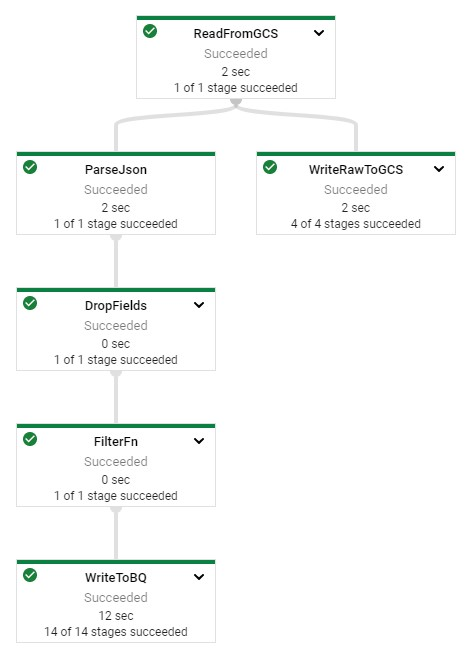

# Dataflow Flex Templates - Java

## Initialize

    $ gcloud auth list
    $ gcloud config list project

## IDE

http://34.121.202.203:3000/#/home/project/training-data-analyst/quests/dataflow/

## Setup Pipeline

### Open Lab

    IDE $ cd 2_Branching_Pipelines/labs
    IDE $ mvn clean dependency:resolve
    IDE $ export BASE_DIR=$(pwd)

### Setup Environment

    IDE $ cd $BASE_DIR/../..
    IDE $ source create_batch_sinks.sh
    IDE $ source generate_batch_events.sh
    IDE $ cd $BASE_DIR

### Update Pipeline Code

    IDE $ cp /home/project/training-data-analyst/quests/dataflow/2_Branching_Pipelines/solution/src/main/java/com/mypackage/pipeline/MyPipeline.java $BASE_DIR/src/main/java/com/mypackage/pipeline/
    
## Create Custom Flex Template

### Edit POM

pom.xml

    <maven-shade-plugin.version>3.2.3</maven-shade-plugin.version>
    
    <plugin>
      <groupId>org.apache.maven.plugins</groupId>
      <artifactId>maven-shade-plugin</artifactId>
      <version>${maven-shade-plugin.version}</version>
      <executions>
        <execution>
          <phase>package</phase>
          <goals>
            <goal>shade</goal>
          </goals>
          <configuration>
            <transformers>
              <transformer implementation="org.apache.maven.plugins.shade.resource.ServicesResourceTransformer"/>
            </transformers>
            <filters>
              <filter>
                <artifact>*:*</artifact>
                <excludes>
                  <exclude>META-INF/*.SF</exclude>
                  <exclude>META-INF/*.DSA</exclude>
                  <exclude>META-INF/*.RSA</exclude>
                </excludes>
              </filter>
            </filters>
          </configuration>
        </execution>
      </executions>
    </plugin>
    
    IDE $ cd $BASE_DIR
    IDE $ mvn clean package
    
    IDE $ ls -lh target/*.jar

### Create Dockerfile

Dockerfile

    IDE $ nano Dockerfile
    
    FROM gcr.io/dataflow-templates-base/java11-template-launcher-base:latest
    # Define the Java command options required by Dataflow Flex Templates.
    ENV FLEX_TEMPLATE_JAVA_MAIN_CLASS="YOUR-CLASS-HERE"
    ENV FLEX_TEMPLATE_JAVA_CLASSPATH="/template/pipeline.jar"
    # Make sure to package as an uber-jar including all dependencies.
    COPY target/YOUR-JAR-HERE.jar ${FLEX_TEMPLATE_JAVA_CLASSPATH}
    
    IDE $ gcloud config set builds/use_kaniko True
    
    IDE $ export TEMPLATE_IMAGE="gcr.io/$PROJECT_ID/my-pipeline:latest"
    IDE $ gcloud builds submit --tag $TEMPLATE_IMAGE .
    
gcp > Cloud Build

### Create and Stage Flex Template

metadata.json

    IDE $ nano metadata.json

    {
      "name": "Your pipeline name",
      "description": "Your pipeline description",
      "parameters": [
        {
          "name": "inputSubscription",
          "label": "Pub/Sub input subscription.",
          "helpText": "Pub/Sub subscription to read from.",
          "regexes": [
            "[-_.a-zA-Z0-9]+"
          ]
        },
        {
          "name": "outputTable",
          "label": "BigQuery output table",
          "helpText": "BigQuery table spec to write to, in the form 'project:dataset.table'.",
          "is_optional": true,
          "regexes": [
            "[^:]+:[^.]+[.].+"
          ]
        }
      ]
    }

### Build Template

    IDE $ export TEMPLATE_PATH="gs://${PROJECT_ID}/templates/mytemplate.json"
    IDE $ gcloud beta dataflow flex-template build $TEMPLATE_PATH \
    --image "$TEMPLATE_IMAGE" \
    --sdk-language "JAVA" \
    --metadata-file "metadata.json"
    
### Execute Template from UI

gcp > Dataflow > Create Job from Template

|Item|Value|
|-|-|
|Dataflow template|Custom Template|
|Template Path|gs://qwiklabs-gcp-02-dbe8fd71a4e8/templates/mytemplate.json|
|Input file path|gs://qwiklabs-gcp-02-dbe8fd71a4e8/events.json|
|Output file location|gs://qwiklabs-gcp-02-dbe8fd71a4e8-coldline/|
|BigQuery output table|qwiklabs-gcp-02-dbe8fd71a4e8:logs.logs_filtered|

### Execute Template using Gcloud

    IDE $ export PROJECT_ID=$(gcloud config get-value project)
    IDE $ export REGION='us-central1'
    IDE $ export JOB_NAME=mytemplate-$(date +%Y%m%H%M$S)
    IDE $ export TEMPLATE_LOC=gs://${PROJECT_ID}/templates/mytemplate.json
    IDE $ export INPUT_PATH=gs://${PROJECT_ID}/events.json
    IDE $ export OUTPUT_PATH=gs://${PROJECT_ID}-coldline/
    IDE $ export BQ_TABLE=${PROJECT_ID}:logs.logs_filtered
    IDE $ gcloud beta dataflow flex-template run ${JOB_NAME} \
    --region=$REGION \
    --template-file-gcs-location ${TEMPLATE_LOC} \
    --parameters "inputPath=${INPUT_PATH},outputPath=${OUTPUT_PATH},tableName=${BQ_TABLE}"

# Dataflow Flex Templates - Python

[Gihub Source Code](https://github.com/GoogleCloudPlatform/training-data-analyst/tree/master/quests/dataflow_python/2_Branching_Pipelines/solution)

## Initialize

    $ gcloud auth list
    $ gcloud config list project

## Get Repo

    $ git clone https://github.com/GoogleCloudPlatform/training-data-analyst
    $ cd ~/training-data-analyst/quests/dataflow_python/
    
    $ cd 2_Branching_Pipelines/lab
    $ export BASE_DIR=$(pwd)
    
## setup Virtual Environment

    $ sudo apt-get install -y python3-venv
    $ python3 -m venv df-env
    $ source df-env/bin/activate

## Install Packages

    $ python3 -m pip install -q --upgrade pip setuptools wheel
    $ python3 -m pip install apache-beam[gcp]

## Enable Dataflow API

    $ gcloud services enable dataflow.googleapis.com
    
## Setup Data Environment

    $ cd $BASE_DIR/../..
    $ source create_batch_sinks.sh
    $ source generate_batch_events.sh
    $ cd $BASE_DIR
    
## Update Pipeline Code

    $ cp /home/$USER/training-data-analyst/quests/dataflow_python/2_Branching_Pipelines/solution/my_pipeline.py $BASE_DIR
    
## Create Dataflow Flex Template

    $ gcloud config set builds/use_kaniko True

Dockerfile

    $ nano Dockerfile
    
    FROM gcr.io/dataflow-templates-base/python3-template-launcher-base
    ARG WORKDIR=/dataflow/template
    RUN mkdir -p ${WORKDIR}
    WORKDIR ${WORKDIR}
    RUN apt-get update && apt-get install -y libffi-dev && rm -rf /var/lib/apt/lists/*
    COPY my_pipeline.py .
    ENV FLEX_TEMPLATE_PYTHON_PY_FILE="${WORKDIR}/my_pipeline.py"
    RUN python3 -m pip install apache-beam[gcp]==2.25.0
    
    $ export TEMPLATE_IMAGE="gcr.io/$PROJECT_ID/dataflow/my_pipeline:latest"
    $ gcloud builds submit --tag $TEMPLATE_IMAGE .
    
## Create and Stage Flex Template

metadata.json

    {
      "name": "My Branching Pipeline",
      "description": "A branching pipeline that writes raw to GCS Coldline, and filtered data to BQ",
      "parameters": [
        {
          "name": "inputPath",
          "label": "Input file path.",
          "helpText": "Path to events.json file.",
          "regexes": [
            ".*\\.json"
          ]
        },
        {
          "name": "outputPath",
          "label": "Output file location",
          "helpText": "GCS Coldline Bucket location for raw data",
          "regexes": [
            "gs:\\/\\/[a-zA-z0-9\\-\\_\\/]+"
          ]
        },
        {
          "name": "tableName",
          "label": "BigQuery output table",
          "helpText": "BigQuery table spec to write to, in the form 'project:dataset.table'.",
          "regexes": [
            "[^:]+:[^.]+[.].+"
          ]
        }
      ]
    }
    
    $ export TEMPLATE_PATH="gs://${PROJECT_ID}/templates/mytemplate.json"
    $ gcloud beta dataflow flex-template build $TEMPLATE_PATH \
    --image "$TEMPLATE_IMAGE" \
    --sdk-language "PYTHON" \
    --metadata-file "metadata.json"
    
## Execute Template UI

gcp > Dataflow > Create Job from Template

|Item|Value|
|-|-|
|Dataflow template|Custom Template|
|Template Path|gs://qwiklabs-gcp-03-000320ac4014/templates/mytemplate.json|
|Input file path|gs://qwiklabs-gcp-03-000320ac4014/events.json|
|Output file location|gs://qwiklabs-gcp-03-000320ac4014-coldline/template_output/|
|BigQuery output table|qwiklabs-gcp-03-000320ac4014:logs.logs_filtered|

## Execute Pipeline using gcloud

    $ export PROJECT_ID=$(gcloud config get-value project)
    $ export REGION='us-central1'
    $ export JOB_NAME=mytemplate-$(date +%Y%m%H%M$S)
    $ export TEMPLATE_LOC=gs://${PROJECT_ID}/templates/mytemplate.json
    $ export INPUT_PATH=gs://${PROJECT_ID}/events.json
    $ export OUTPUT_PATH=gs://${PROJECT_ID}-coldline/template_output/
    $ export BQ_TABLE=${PROJECT_ID}:logs.logs_filtered
    $ gcloud beta dataflow flex-template run ${JOB_NAME} \
    --region=$REGION \
    --template-file-gcs-location ${TEMPLATE_LOC} \
    --parameters "inputPath=${INPUT_PATH},outputPath=${OUTPUT_PATH},tableName=${BQ_TABLE}"
    

