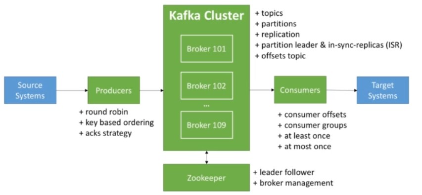

# General

* Topic: a particular stream of data (like a table in a relational db)
  * Replication Factor: How often is a certain topic distributed on the Kafka cluster?
  
* Partition: Topics are split in partitions (Arbitrary number). Each partition is ordered.
  * Offset: A partitions incremental id
  * Data is deleted after some time
  * Data is immutable

* Broker: A Kafka cluster is composed of multible brokers (servers)
  * ID: Each broker has its own id. Each broker contains certain topic partitions
  * A good amount to start is 3 brokers
  * Only a single broker can be a leader for a specific partition. The other brokers synchronise the data (ISR in-sync-replica).
  * Each brokers knows about the other brokers

* Producer: Writes data to topics
  * Loadbalancing between brokers
  * Message Keys: If null > round robin, If key is send data gets always to the same partition. Key can be any string. Kafka ensures that data for a specific key is always written to the same partition and is therefore sorted.
  * As long as the number of partitions is unchanged, the same key will go to the same partition.
    
* Consumers
  * Read data from a topic
  * Groups: Consumers read data in groups
  * No Consumers > No Partitions: Some consumers are inactive
  * Offset: Each consumer group stores its specific offset per topic in a Kafka Topic
  * Delivery Semantics: At most once, At least one (preferred), Exactly once

* Zookeper
  * Manages brokers (keeps a list of them)
  * Kafka cannot work without Zookeeper
  

# Commands

## Topic

    $ kafka-topics.sh --zookeeper 0.0.0.0:2181 --topic first_topic --create --partitions 3 --replication-factor 1
    $ kafka-topics.sh --zookeeper 0.0.0.0:2181 --list
    $ kafka-topics.sh --zookeeper 0.0.0.0:2181 --topic first_topic --describe
    
## Producer

    $ kafka-console-producer.sh --broker-list 0.0.0.0:9092 --topic first_topic
    > first
    > second
    > ...
    $ kafka-console-producer.sh --broker-list 0.0.0.0:9092 --topic first_topic --producer-property acks=all
    > third
    > fourth
    > ...
    
## Consumer

Only messages that are currently streamed by the producer are displayed by the consumer

    $ kafka-console-consumer.sh --bootstrap-server 0.0.0.0:9092 --topic first_topic
    
Sho historic messages

    $ kafka-console-consumer.sh --bootstrap-server 0.0.0.0:9092 --topic first_topic --from-beginning
    
## Consumer Group

Messages are split between consumers within the same consumer group by the topic partitions

    $ kafka-console-consumer.sh --bootstrap-server 0.0.0.0:9092 --topic first_topic --group my-first-application
    $ kafka-console-consumer.sh --bootstrap-server 0.0.0.0:9092 --topic first_topic --group my-first-application
    $ kafka-console-consumer.sh --bootstrap-server 0.0.0.0:9092 --topic first_topic --group my-first-application
    
Get status consumer group

    $ kafka-consumer-groups.sh --bootstrap-server 0.0.0.0:9092 --describe --group my-first-application
    
    GROUP                TOPIC           PARTITION  CURRENT-OFFSET  LOG-END-OFFSET  LAG
    my-first-application first_topic     0          0               1               1
    my-first-application first_topic     1          1               2               1
    my-first-application first_topic     2          1               2               1

Catch up Messages

    $ kafka-console-consumer.sh --bootstrap-server 0.0.0.0:9092 --topic first_topic --group my-first-application
    $ kafka-consumer-groups.sh --bootstrap-server 0.0.0.0:9092 --describe --group my-first-application

    GROUP                TOPIC           PARTITION  CURRENT-OFFSET  LOG-END-OFFSET  LAG
    my-first-application first_topic     0          1               1               0
    my-first-application first_topic     1          2               2               0
    my-first-application first_topic     2          2               2               0

## Reset Offsets

    $ kafka-consumer-groups.sh --bootstrap-server 0.0.0.0:9092 --group my-first-application --reset-offsets --to-earliest --execute --topic first_topic
